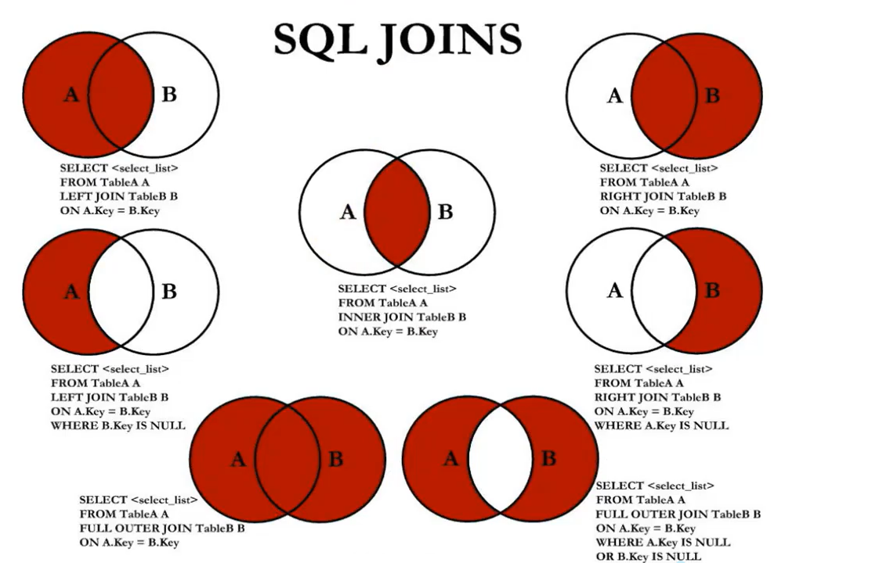

## SQL

### 表的关联关系

1. 一对一关联
2. 一对多关联
3. 多对多关联
4. 自我引用


### SQL分类

1. DDL（Data Definition Languages、数据定义语言），这些语句定义了不同的数据库、表、视图、索引等数据库对象，还可以用来创建、删除、修改数据库和数据表的结构。
   	主要的语句关键字包括CREATE、DROP、ALTER、RENAME、TRUNCATE等。

   

2. DML（Data Manipulation Language、数据操作语言），用于添加、删除、更新和查询数据库记录，并检查数据完整性。

   ​	主要的语句关键字包括INSERT、DELETE、UPDATE、SELECT等。
   
3. DCL（Data Control Language、数据控制语言），用于定义数据库、表、字段、用户的访问权限和安全级别。

   ​	主要的语句关键字包括GRANT、REVOKE、COMMIT、ROLLBACK、SAVEPOINT等。


### select

```sql
-- 选择
select ... from ...

where

-- 查看表的详细信息
desc tablename

-- 排序
order by
-- desc(descend) 降序
-- asc(ascend) 升序

-- 限制
limit 0,20
-- limit 20 offset 0    偏移量0 数量20

case 字段 when 条件1 then 结果1 when 条件2 then 结果2 end

-- 分组
group by

-- 条件筛选，只能在 group by 中使用
having

-- 去重
distinct
-- distinct 只能出现在所有字段的最前方，会对后面所有字段进行联合去重
```

#### 注意事项
1. 字符串存在隐式转换，如果转换不成功，则为0
2. 表名如果和关键字重名，可以用 ` 包围
3. case 字段 when 条件1 then 结果1 when 条件2 then 结果2 end
4. 在一条`select`语句当中，如果有`group by`语句中的话，`select`后面只能跟：参加分组的字段，以及分组函数
5. 执行顺序
   from -> where -> group by -> having -> select -> order by -> limit
6. 分组函数只有在分组后，才能使用，如：min,max,avg,count
7. `where`和`having`，优先选择`having`
8. 列的别名只能在 ORDER BY 中使用，不能在 WHERE 中使用
9. DUAL表示虚拟表


### 算术运算符

1. 算数运算符（+、-、*、/、div、%、mod）

```
100 + '1'	// 101	会将数值隐式转化
100 + 'a'	// 100	字符串无法隐式转化看作 0
100 + null	// null 和任何数做运算都为null
100 div 0	// null 除数为0,结果为null
```

2. 比较运算符

```
=			等于运算符
<==>		安全等级运算符
			安全等于运算符（<=>）与等于运算符（=）的作用是相似的
			唯一的区别是‘<=>'可以用来对NULL进行判断
			在两个操作数均为NULL时，其返回值为1，而不为NULL；
			当一个操作数为NULL时，其返回值为0，而不为NULL。
		
<>			 不等于
!=			 不等于

IS NULL					为空运算符
IS NOT NULL				不为空运算符
LEAST					最小值运算符
GREATEST				最大值运算符
BETWEEN	... AND ...		 两值之间的运算符
ISNULL					为空运算符,函数
IN						属于运算符
NOT IN					不属于运算符
LIKE					模糊匹配运算符
						%			表示不确定个数的字符
						_			表示一个不确定的字符
						\			表示转义字符
						
REGEXP					正则表达式运算符
RLIKE					正则表达式运算符
```

注意：escape '$' 表示可以将$作为转义字符

4. 逻辑运算符

```
NOT	或 ！		逻辑非
AND或&&		 逻辑与
OR或||		 逻辑或
XOR		      逻辑异或
```

AND的优先级高于OR


### 排序

默认是升序

升序：ASC(ascend)

降序：DESC(descend)

二级排序，直接在逗号后面加排序条件


### 多表查询
- 表连接的方式

  - 内连接(表之间没有主次关系)
      - 等值连接
      - 非等值连接
      - 自连接
- 外连接
      - 左外连接（左连接，左边的是主表）
      - 右外连接（右连接，右边的是主表） 
  - 全连接



```sql
内连接：合并具有同一列的两个以上的表的行，结果集中不包含一个表与另一个表不匹配的行
外连接：两个表在连接过程中除了返回满足连接条件的行以外还返回左（或右）表中不满足条件的行，这种连接称为左（或右）外连接。没有匹配的行时，结果表中相应的列为空（NULL）。


-- 内连接的等值连接
join 表名 on 条件

select
    ...
from
    ...
inner join
    b
on
    a和b的连接条件


-- 外连接的右连接
select
    e.ename,d.dname
from
    dept d
left outer join
    emp e
on
    d.deptno = d.deptno
 
-- 连接两个表 
union

-- 自然连接
-- NATURALJOIN：它会帮你自动查询两张连接表中所有相同的字段，然后进行等值连接。
SELECT employee_id，last_name，department_name 
FROM employees e NATURAL JOIN departments d；

--USING
SELECT employee_id，last_name，department_name 
FROM employees e 
JOIN departments d 
USING（department_id）；
-- 你能看出与自然连接NATURALJOIN不同的是，USING指定了具体的相同的字段名称，你需要在USING的括号（）中填入要指定的同名字段。同时使用JOIN...USING可以简化JOIN ON的等值连接。它与下面的SQL 查询结果是相同的：
SELECT employee_id，last_name，department_name 
FROM employees e，departments d 
WHERE e.department_id=d.department_id；
```

注意事项

 1. 多表选举的时候，指明字段在那个表中可以增加效率，在`from`中给表起别名。如果给表起了别名，一旦在SELECT或WHERE中使用表名的话，则必须使用表的别名，而不能再使用表的原名。
 2. 外连接的查询结果条数一定大于内连接的结果条数


### Union

合并查询结果
利用UNION关键字，可以给出多条SELECT语句，并将它们的结果组合成单个结果集。合并时，两个表对应的列数和数据类型必须相同，并且相互对应。各个SELECT语句之间使用UNION或UNION ALL关键字分隔。

UNION 操作符:返回两个查询的结果集的并集，去除重复记录。

UNION ALL 操作符:返回两个查询的结果集的并集。对于两个结果集的重复部分，不去重。

```
注意：
执行UNIONALL语句时所需要的资源比UNION语句少。如果明确知道合并数据后的结果数据不存在重复数据，或者不需要去除重复的数据，则尽量使用UNION ALL语句，以提高数据查询的效率。
```


### 函数

#### 单行函数

单行函数
·操作数据对象
·接受参数返回一个结果
·只对一行进行变换,每行返回一个结果
.可以嵌套
·参数可以是一列或一个值


### 建表

数据类型

1. varchar      可变长度的字符串
                比较智能，节省空间。
                会根据实际的数据长度动态分配空间。
                优点：节省空间
                缺点：需要动态分配空间，速度慢。
2. char         定长字符串
                不管实际的数据长度是多少。
                分配固定长度的空间去存储数据。
                使用不恰当的时候，可能会导致空间的浪费。
                优点：不需要动态分配空间，速度快。缺点：使用不当可能会导致空间的浪费。
3. int          数字中的长整型
4. bigint       数字中的长整型。等同于java中的long。
5. float        单精度浮点型数据
6. double       双精度浮点型数据
7. date         短日期类型，只包括年月日
8. datetime     长日期类型，包括年月日时分秒
9. clob         字符大对象
                最多可以存储4G的字符串。
                比如：存储一篇文章，存储一个说明。
                超过255个字符的都要采用CLOB字符大对象来存储。
                Character Large OBject:CLOB 
10. b1ob        二进制大对象
                Binary Large OBject专门用来存储图片、声音、视频等流媒体数据。


```sql
now()
-- 获取系统当前时间

-- 跟新表
-- 如果没有条件限制，会导致所有数据更新
update 表名 set 字段名1=值1,字段2=值2,字段3=值3 where 条件

-- 删除
-- 没有条件,整张表都会被删除
delete from 表名 where 条件

-- 快速删除
truncate
-- 不支持回滚

-- 快速创建一个表
create table 副本 as select * from 主表;

-- 删除表
drop table

-- 执行sql脚本文件
source sql文件
```

### 约束

非空约束：not null 
    只有列级约束，没有表级约束

唯一性约束：unique

主键约束：primary key(简称PK)
    如果一个字段同时被 not null 和 unique 约束的话，该字段自动变成主键字段

外键约束：foreign key(简称FK)

```sql
-- 自增
auto_increment

-- 外键约束
foreign key(字段) references 主表(字段)
```

### 事务
transaction

一个完整的业务逻辑

只有 insert 、delete 、 update 和事务有关

在事务的执行过程中，每一条DML的操作都会记录到事务性活动的日志文件中。
在事务的执行过程中，我们可以提交事务，也可以回滚事务。

提交事务？
清空事务性活动的日志文件，将数据全部彻底持久化到数据库表中。
提交事务标志着，事务的结束。并且是一种全部成功的结束。

回滚事务？
将之前所有的DL操作全部撤销，并且清空事务性活动的日志文件。
回滚事务标志着，事务的结束。并且是一种全部失败的结束。

MySQL默认提交事务，每执行一条就提交了，不能回滚

<hr/>

事务的隔离性

1. 读未提交：read uncommitted（最低的隔离级别）《没有提交就读到了》
什么是读未提交？
事务A可以读取到事务B未提交的数据。
这种隔离级别存在的问题就是：
脏读现象！（Dirty Read）
我们称读到了脏数据。
这种隔离级别一般都是理论上的，大多数的数据库隔离级别都是二档起步！

2. 读已提交：read committed《提交之后才能读到》
什么是读已提交？
事务A只能读取到事务B提交之后的数据。
这种隔离级别解决了什么问题？
解决了脏读的现象。
这种隔离级别存在什么问题？
不可重复读取数据。
什么是不可重复读取数据呢？
在事务开启之后，第一次读到的数据是3条，当前事务还没有结束，可能第二次再读取的时候，读到的数据是4条，3不等于4称为不可重复读取。
这种隔离级别是比较真实的数据，每一次读到的数据是绝对的真实。
oracle数据库默认的隔离级别是：read committed

3. 可重复读：repeatable read《提交之后也读不到，永远读取的都是刚开启事务时的数据》
什么是可重复读取？
事务A开启之后，不管是多久，每一次在事务A中读取到的数据都是一致的。即使事务B将数据已经修改，并且提交了，事务A读取到的数据还是没有发生改变，这就是可重复读。
可重复读解决了什么问题？解决了不可重复读取数据。可重复读存在的问题是什么？
可以会出现幻影读。
每一次读取到的数据都是幻象。不够真实！
早晨9点开始开启了事务，只要事务不结束，到晚上9点，读到的数据还是那样！
读到的是假象。不够绝对的真实。
mysq1中默认的事务隔离级别就是这个！！！

4. 序列化/串行化：serializable（最高的隔离级别）这是最高隔离级别，效率最低。
解决了所有的问题。这种隔离级别表示事务排队，不能并发！
synchronized，线程同步（事务同步）每一次读取到的数据都是最真实的，并且效率是最低的。

```sql
-- 手动开启事务,关闭自动提交机制
start transaction

-- 回滚事务，回到上一次提交
rollback

-- 提交事务
-- 将数据写入数据库 

-- 改变事务隔离级别
set global transaction isolation level read uncommitted;    

-- 查看事务隔离级别
select @@tx_isolation
```

### 索引

索引失效的原因
1. 模糊匹配以%开头
2. 使用or,一段有索引,一段没有索引,使用union不会失效
3. 复合索引,没有使用左侧的列查找
4. 索引参加运算

```sql
-- 创建索引
create index emp_ename_index on emp(ename)

-- 删除索引
drop index emp_ename_index on emp
```

### 视图

```sql
-- 创建索引
create view emp_view as select * from emp;
```