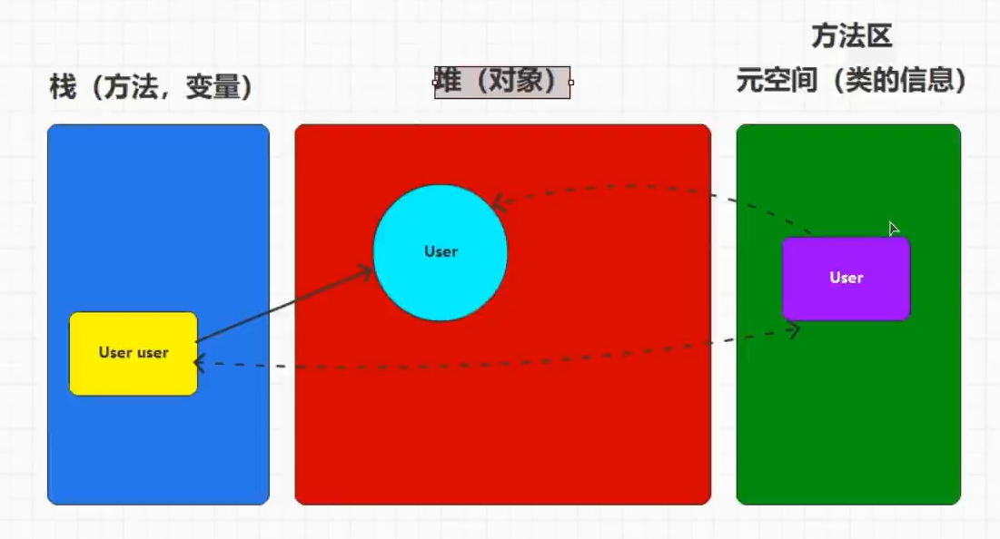
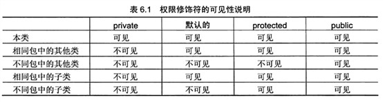
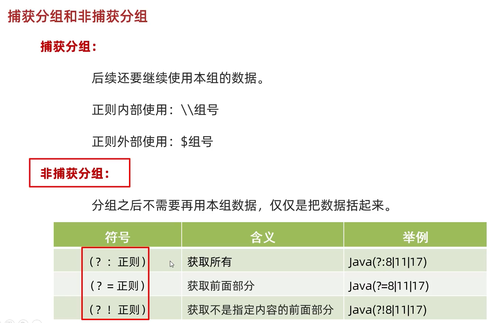
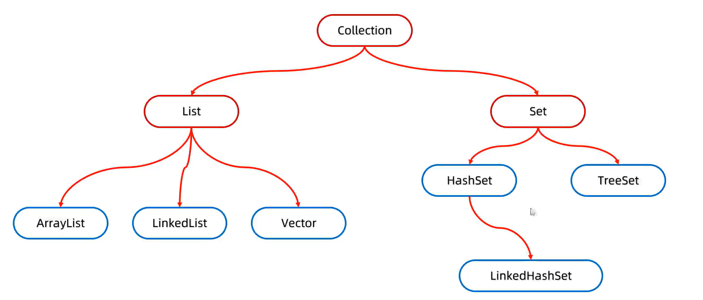
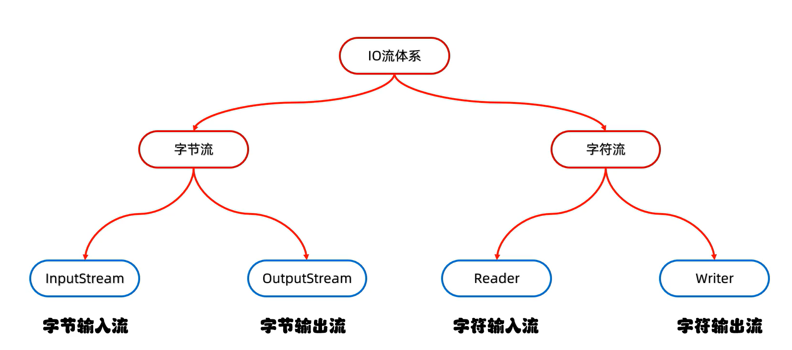
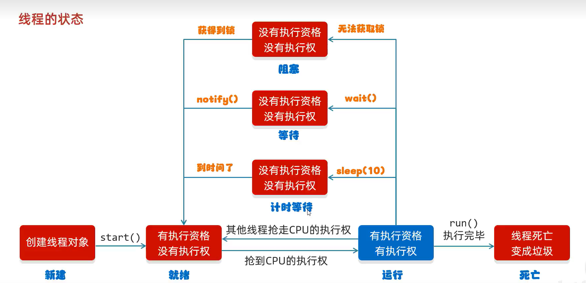

# Java

### 快捷键

```
ctrl-alt-t			surround with
ctrl-alt-v			变量补全
alt-insert			generate
ctrl-b				父级
alt+enter			提示
ctrl+n				查询
ctrl+F12			查询类的属性和方法
ctrl+alt+m			方法包裹
```


### 多态

调用成员时的特点：

调用成员变量的特点：编译看左边，运行看左边

调用成员方法的特点：编译看左边，运行看右边


### 重载

相同的方法指的是方法名，参数列表相同，和返回值类型无关

如果方法名相同，但是参数列表(个数，顺序，类型)不相同，会认为是不同的方法，只不过名称一样


### 对象

成员方法可以访问静态对象和静态方法

静态方法不可以访问成员属性和成员方法 


### import

import 主要用于在使用类前准备好
import语句只能使用在package后，class前
import关键字可以多次使用，导入多个类如果同一个包中需要导入大量的类，那么可以使用通配符星号来简化操作
如果import了不同包中相同名称的类，那么还是需要在使用时增加包名。





### 数组

完整格式：数据类型 [] 数组名 = new 数据类型[]{元素1，元素2，元素3}

简写：数据类型 [] 数组名 = {元素1，元素2，元素3}


### 函数

可变参数

```java
void test(string...args){}
```


### 权限

Java中的访问权限主要分为4种：

```
1.private：私有的，同一个类中可以使用
2.(defauLt)：默认权限，当不设定任何权限时，JVM会就认提供权限，包(路径)权限
3.protected：受保护的权限，子类可以访问
4.public：公共的，在意使用
```



### 内部类

```java
class OuterClass{
    public class InnerClass{       
    }
}

OuterClass outer = new OuterClass();
OuterClass.InnerClass innerClass = outer.new InnerClass()
```


### 枚举

```java
enum City{
    BEIJING("北京",1001),SHNAGHAI("上海",1002);
    
    City(string name,int code){
         this.code = code;
        this.name = name;
    }
     public String name;
     public int code;
    
}

System.out.println(City.BEIJING.code) //1001
```

```java
// 原理
class MyCity{
    public String name;
    public int code;
    
    private MyCity(string name,int code){
        this.code = code;
        this.name = name;
    }
    
    public static final MyCity BEIJING = new MyCIty("北京",1001); 
    public static final MyCity SHNAGHAI = new MyCIty("上海",1002);
}
```


### 正则表达式

```java
String str = "hello12af34";
Pattern p =  Pattern.compile("\\d{1,2}");
Matcher m = p.matcher(str);
while (m.find()){
    String s1 = m.group();
    System.out.println(s1);
}
```

java(?=8|11|17)
表示在java后面拼接8或者11或者17，获取只有Java
java(?!8|11|17)
表示在java后面不拼接8或者11或者17，获取只有Java

```java
String regex = "(.).+\\1"
// 分组只以左括号为基础
// 把第x组的内容再拿出来用一次
// 正则表达式内部引用组用 "\\" , 外部用"$"
String result = str.replaceAll("(.)\\1+","$1");
// 替换字符串中重复出现的字符
```



## 集合体系结构

#### 单列集合    `collection`



`list` 系列集合：添加的元素是有序的，可重复，有索引

`set`系列集合：添加的元素是无序]，不重复，无索引

`queue`:队列，有头有尾，中间数据不能出来

`arraylist`方法介绍

| 方法名                         | 说明                                 |
| ------------------------------ | ------------------------------------ |
| `add()`                        | 添加元素                             |
| `add(int index, Object value)` | 在指定位置添加元素添加元素           |
| `addAll(list,elements)`        | 把集合的元素都添加进来               |
| `get(int index)`               | 根据指定索引获取元素                 |
| `set(int index,Object value)`  | 修改值当索引的值                     |
| `remove( int index)`           | 删除指定索引的值                     |
| `int size()`                   | 集合的长度，也就是集合中键值对的个数 |
| `boolean isEmpty()`            | 判断集合是否为空                     |
| `void   clear()`               | 移除所有的元素                       |
| `removeall (Collection list)`  | 删除指定集合中的元素                 |
| `Boolean contains(Object o)`   | 判断是否包含指定的元素               |
| `toArrary()`                   | 转变为数组                           |
| `clone()`                      | 复制新集合                           |
| `shuffle()`                    | 随机打乱原来的顺序                   |


`linkedlist`方法介绍

| 方法名                       | 说明                       |
| ---------------------------- | -------------------------- |
| getFirst()                   | 获取第一个元素             |
| getLast()                    | 获取最后一个元素           |
| addFirst()                   | 在第一个位置添加元素       |
| add(int index, Object value) | 在指定位置添加元素添加元素 |


`ArraryBlockingQueue` 

| 方法名 | 说明                                   |
| ------ | -------------------------------------- |
| put    | 添加数据，多余的会堵塞                 |
| offer  | 添加数据成功时，返回true,失败返回false |
| poll   | 从队头取出数据,没有数据时不会堵塞      |
| take   | 从队头取出数据,没有数据时会堵塞        |


### 双列集合    map

双列集合的特点
①双列集合一次需要存一对数据，分别为键和值
②键不能重复，值可以重复
③键和值是一一对应的，每一个键只能找到自己对应的值
④键+值这个整体我们称之为“键值对”或者“键值对对象”，在Java中叫做“Entry对象”

方法介绍

| 方法名                                | 说明                                 |
| ------------------------------------- | ------------------------------------ |
| `put(K key,V   value)`                | 添加元素,如果有就修改                |
| `put(K key,V   value)`                | 替换元素,如果没有就不修改            |
| `putIfAbssent(K key,V   value)`       | 如果键不存在，才会添加元素           |
| `remove(Object key)`                  | 根据键删除键值对元素                 |
| `get(Object key)`                     | 根据键获取键值对元素                 |
| `void clear()`                        | 移除所有的键值对元素                 |
| `boolean containsKey(Object key)`     | 判断集合是否包含指定的键             |
| `boolean containsValue(Object value)` | 判断集合是否包含指定的值             |
| `boolean isEmpty()`                   | 判断集合是否为空                     |
| `int size()`                          | 集合的长度，也就是集合中键值对的个数 |
| `keySet()`                            | 取出键为集合                         |
| `values()`                            | 取出值为集合                         |
| `entrySet()`                          | 取出键值对为集合                     |

`hashmap`:数组+单向链表

`hashmap`和`hashtable`的区别

1.实现方式不一样的：继承父类不一样
2.底层结构的容量不同：`HashMap`(16)，`Hashtable`(11)
3`.HashMap`K，V都可以为`null`，`Hashtable`k，V不能是`null`
4.`HashMap`的数据定位采用的是Hash算法，但是`HashtabLe`采用的就是`hashcode`
5.`HashMap`的性能较高，但是`Hashtable`较低


### `Arrarys方法`

| 方法名                             | 说明               |
| ---------------------------------- | ------------------ |
| `Arrarys.toString(arrary)`         | 将数组转化为字符串 |
| `Arrarys.asList(arrary)`           | 将数组转化为集合   |
| `Arrarys.sort(arrary)`             | 排序数组           |
| `Arrarys.equals(arrary)`           | 比较数组           |
| `Arrarys.binarySearch(arrary,key)` | 二分查找法         |


### 迭代器

```java
//TODO迭代器
Iterator<String> iterator = keys.iterator();
//hasNext方法用于判断是否存在下一条数据
while(iterator.hasNext()){
    //获取下一条数据
    String key = iterator.next();
    if("b".equals(key)){
        //remove方法只能对当前数据删除
        iterator.remove();
    }
    system.out.printin(map.get(key));
}
```


### Lambda表达式

Lambda表达式可以用来简化匿名内部类的书写
Lambda表达式只能简化函数式接口的匿名内部类的写法函数式接口：
有且仅有一个抽象方法的接口叫做函数式接口，接口上方可以加`@Functionallnterface`注解

参数类型可以省略不写。
如果只有一个参数，参数类型可以省略，同时（）也可以省略。
如果Lambda表达式的方法体只有一行，大括号，分号，return可以省略不写，需要同时省略。

```java
Arrays. sort(arr, new Comparator<Integer>(){
	@ Override 
    public int compare(Integer o1, Integer o2){
		return o1-o2;
    }
});

Arrays. sort(arr,(Integer o1, Integer o2)->{
	return ol-o2;
);
```


### 泛型

```
1. 泛型中不能写基本数据类型
2. 指定泛型的具体类型后，传递数据时，可以传入该类类型或者其子类类型
3. 如果不写泛型，类型默认是Object
4. 泛型不具备继承性，但是数据具备继承性
5. 泛型的通配符?可以表示不确定类型
    ？extends E：表示可以传递E或者E所有的子类类型
    ？super E：表示可以传递E或者E所有的父类类型
```

```java
// 泛型方法
public static<E> void addAll(Arraylist<E> list,E el){
	list. add(e1);
}
```


### stream流

```
Stream流的使用步骤：
①先得到一条Stream流（流水线），并把数据放上去

	获取方式     方法名                            说明
	单列集合	default Stream<E>stream（）		Collection中的默认方法
    双列集合	无无法直接使用stream流
    数组		  public static <T> Stream<T> stream（T]array）Arrays工具类中的静态方法
    一堆零散数据 public static<T> Stream<T> of（T...values）Stream接口中的静态方法
	
②使用中间方法对流水线上的数据进行操作 
	
	Stream<T>filter（Predicate<？super T>predicate）过滤
	Stream<T>limit（long maxsize）获取前几个元素
	stream<T> skip（long n）跳过前几个元素
	Stream<T>distinct（）元素去重，依赖（hashCode和equals方法）
	static <T> Stream<T> concat（Stream a，Stream b）合并a和b两个流为一个流
    Stream<R>map（Function<T，R>mapper）转换流中的数据类型
    
    注意1：中间方法，返回新的Stream流，原来的Stream流只能使用一次，建议使用链式编程
    注意2：修改stream流中的数据，不会影响原来集合或者数组中的数据
    
③使用终结方法对流水线上的数据进行操作
	void forEach（Consumer action）		遍历
	long count（）					   统计
	toArray（）						   收集流中的数据，放到数组中
	collect（Collector collector）         收集流中的数据，放到集合中
	collect(key->keyVlaue,value->mapValue)

toArrary
//toArray方法的参数的作用：负责创建一个指定类型的数组
//toArray方法的底层，会依次得到流里面的每一个数据，并把数据放到数组当中
//toArray方法的返回值：是一个装着流里面所有数据的数组
```


### 方法引用

```
1. 引用处必须是函数式接口
2.被引用的方法必须已经存在
3.被引用方法的形参和返回值，需要跟抽象方法保持一致
4.被引用方法的功能要满足当前需求
```

```java
// 引用静态方法
类名::静态方法

// 引用成员方法
格式：对象::成员方法
①其他类：其他类对象::方法名
②本类：this::方法名
③父类：super::方法名

// 引用构造方法
格式：类名：：new

// 使用类名引用成员方法
格式：类名：：成员方法
范例：String:：substring
抽象方法形参的详解：
第一个参数：表示被引用方法的调用者，决定了可以引用哪些类中的方法在Stream流当中，第一个参数一般都表示流里面的每一个数据。a设流里面的数据是字符串，那么使用这种方式进行方法引用，只能引用String这个类中的方法第
二个参数到最后一个参数：跟被引用方法的形参保持一致，如果没有第二个参数，说明被引用的方法需要是无参的成员方法

// 用数组的构造方法
格式：数据类型[]：：new
范例：int[]：：new
```


### 键盘录入

```java
Scanner sc = new Scanner(System.in);
String name = sc.nextLine();a
```


### 异常

```
Throwable的成员方法
        方法名称						 说明
        public string getMessage（）		返回此throwable的详细消息字符串
        public string toString（）		返回此可抛出的简短描述
        public void printStackTrace（）	把异常的错误信息输出在控制台
        
throws
写在方法定义处，表示声明一个异常告诉调用者，使用本方法可能会有哪些异常
编译时异常：必须要写。运行时异常：可以不写。

throw
写在方法内，结束方法手动抛出异常对象，交给调用者。方法中下面的代码不再执行了

// 实现了zutocloseable的接口会自动关闭流，无需手动
try(io流){

}catch(){

}

```


```java
try{
    // JDK7 以后多个异常可以用 | 写在一起，表示或者
}catch(ArraryIndexOutOfBoundsException | ArithmeticExceptions e){
    
}
```


### File

```java
File file = new File(Filepath);

public File（string pathname）根据文件路径创建文件对象
public File（String parent，String child）根据父路径名字符串和子路径名字符串创建文件对象
public File（File parent，String child）根据父路径对应文件对象和子路径名字符串创建文件对象
```

| 方法名                      | 说明                           |
| --------------------------- | ------------------------------ |
| ` isFile()`                 | 判断是否是文件                 |
| ` isDirectory()`            | 判断是否是文件夹               |
| ` exists()`                 | 判断文件是否存在               |
| `mkdir()`                   | 根据路径创建单级文件夹         |
| ` mkdirs()`                 | 根据路径创建多级文件夹``       |
| `delete()`                  | 删除文件和空文件夹             |
| ` createNewFile()`          | 根据路径创建文件               |
| `getName()`                 | 获取文件名，带后缀             |
| `length()`                  | 获取文件大小（字节数量）       |
| `lastModified()`            | 获取最后修改时间（时间毫秒值） |
| `getAbsolutePath()`         | 获取完整路径                   |
| `getAbsolutePath()`         | 获取定义文件时使用的路径       |
| `list()`                    | 根据路径创建文件               |
| `public File[] listFiles()` | 获取当前该路径下所有内容       |


### 字符集

```
GBK
英文：1个字节
中文：
	1. 2个字节，第一个字节叫高位字节,第二个字节叫低位字节
	2. 高位字节二进制一定以1开头，转成十进制之后是一个负数
	
核心1：GBK中，一个英文字母一个字节，二进制第一位是0
核心2：GBK中，一个中文汉字两个字节，二进制第一位是1	 

UTF-8
英文：一个字节
中文：三个字节

乱码原因
1. 读取数据时未读完整个汉字
2. 编码和解码的方式不统一
```


### IO

```
分类：
	-流的方向
		·输入流
		.输出流
	
	-操作文件的类型
		.字节流 （读取所有文件）
		.字符流  (读取纯文本文件)
```




#### 字节流

```
FileOutputStream书写细节
    ①创建字节输出流对象
    	细节1：参数是字符串表示的路径或者File对象都是可以的
    	细节2：如果文件不存在会创建一个新的文件，但是要保证父级路径是存在的。
    	细节3：如果文件已经存在，则会清空文件
    ②写数据
    	细节：write方法的参数是整数，但是实际上写到本地文件中的是整数在ASClI上对应的字符
    ③释放资源
    	细节：每次使用完流之后都要释放资源
    	
void write（int b）						一次写一个字节数据
void write（byte[] b）					一次写一个字节数组数据
void write（byte[] b，int off，int 1en） 	一次写一个字节数组的部分数据

FileOutputStream out = new FileOutputStream(path,true)； 第二个参数表示是否保留之前文件
```

```
FileInputStream细节：
	1.创建字节输入流对象
		细节1：如果文件不存在，就直接报错。
    2.写数据
    	细节1：一次读一个字节，读出来的是数据在ASCII上对应的数字
    	细节2：读到文件末尾了，read方法返回-1。
    3.释放资源
    	细节：每次使用完流之后都要释放资源
    	
   void read（byte[] b）					一次读一个字节数组数据     
   
//1.创建对象
FileInputStream fis = new FileInputStream(path)
//2.读取数据
byte[] bytes = new byte[2]；
//一次读取多个字节数据，具体读多少，跟数组的长度有关
// 返回值：本次读取到了多少个字节数据
int len = fis.read(bytes)；
string str1 = new String(bytes，offset，1en)；
System.out.println(str1)；  
```

```java
// 文件复制
File srcFile = new File(FilePath);
File destFile = new File(FilePath);

//TODO 文件输入流（管道对象）
FileInputStream in = null；
//TODO 文件输出流（答道对象）
FileOutputStream out = null；
try{
	in = new FileInputStream（srcFile）；
	out = new FileOutputStream（destFile）；
	int data = -1；
	//TODO 打开阀1，流转数据（输入）
	while((data = in.read)!=-1){
		//TODO 打开阀门.旅转数据（输出）
		out.write（data）；
	}
}catch（IOException e）{
	throw new RuntimeException（e）；
}finally{
    if（in！=null）{
    try{
        in.close（）；
    }catch（IOException e）{
    	throw new RuntimeException（e）；
    }}
    if（out！=null）{
    try{
        out.close（）；
    }catch（IOException e）{
    	throw new RuntimeException（e）；
    }}
}
```


#### 字符流

```java
字符流
字符流的底层其实就是字节流
字符流 = 字节流 + 字符集

特点
输入流：一次读一个字节，遇到中文时，一次读多个字节
输出流：底层会把数据按照指定的编码方式进行编码，变成字节再写到文件中

使用场景
对于纯文本文件进行读写操作
```

```java
//1.创建对象并关联本地文件
FileReader fr = new FileReader("myio\\a.txt")；
//2.读取数据read（）
//字符流的底层也是字节流，默认也是一个字节一个字节的读取的。
//如果遇到中文就会一次读取多个，GBK一次读两个字节，UTF-8一次读三个字节
// read（）细节：
//1.read（）：默认也是一个字节一个字节的读取的，如果遇到中文就会一次读取多个
//2.在读取之后，方法的底层还会进行解码并转成十进制。
//最终把这个十进制作为返回值
//这个十进制的数据也表示在字符集上的数字
//英文：文件里面二进制数据0110 0001
//read方法进行读取，解码并转成十进制97
//中文：文件里面的二进制数据1110e11e1011000118001881
//read方法进行读取，解码并转成十进制27721
//我想看到中文汉字，就是把这些十进制数据，再进行强转就可以了
int ch；
while((ch = fr.read())！= -1){
	System.out.print((char)ch)；
}
//3.释放资源
fr.close()；
```

```
FileWriter成员方法
成员方法						 			 说明
void write（int c）			    			写出一个字符
void write（string str）		     			 写出一个字符串
void write（string str，int off，int 1en）		写出一个字符串的一部分
void write（char[] cbuf）						写出一个字符数组
void write（char[] cbuf，int off，int 1en）		写出字符数组的一部分
flush										清空缓存区
```

```
字符流原理解析

①创建字符输入流对象
底层：关联文件，并创建缓冲区（长度为8192的字节数组）

②读取数据
底层：
	1.判断缓冲区中是否有数据可以读取
	2.缓冲区没有数据：就从文件中获取数据，装到缓冲区中，每次尽可能装满缓冲区如果文件中也没有	   数据了，返回-1
	3.缓冲区有数据：就从缓冲区中读取。

空参的read方法：一次读取一个字节，遇到中文一次读多个字节，把字节解码并转成十进制返回
有参的read方法：把读取字节，解码，强转三步合并了，强转之后的字符放到数组中
```

```java
File srcFile = new File(FilePath);
File destFile = new File(FilePath);

//TODO 字符输入流（管道对象）
BufferedReader reader = null；
//TODO 字符输出流（答道对象）
PrintWriter writer = null；
try{
	reader = new BufferedReader(new FileReader(srcFile))；
	writer = new PrintWriter(destFile)；
	
	String line = null;
	//TODO 打开阀，流转数据（输入）
	while((line = reader.readLine()) != null){
		//TODO 打开阀门.旅转数据（输出）
		writer.println(line);
	}
	// 刷写数据，将缓存区中的数据清空
	writer.flush();
}catch（IOException e）{
	throw new RuntimeException（e）；
}finally{
    if（reader！=null）{
    try{
        reader.close（）；
    }catch（IOException e）{
    	throw new RuntimeException（e）;
    }}
    if（writer！=null）{
    try{
        writer.close（）；
    }catch（IOException e）{
    	throw new RuntimeException（e）；
    }}
}
```


缓冲区

```
缓冲流需要包裹配套的普通流
BufferedOutputStream buffout = new BufferedOutputStream(new FileOutputStream(name))；

缓冲流有几种？
·字节缓冲输入流：BufferedInputStream
·字节缓冲输出流：BufferedOutputStream
·字符缓冲输入流：BufferedReader
·字符缓冲输出流：BufferedWriter

字节缓存流拷贝文件原理：
	1. 字节输入缓存流在内存开辟了8192字节的字节数组1
	2. 字节输出缓存流在内存开辟了8192字节的字节数组2
	3. read和write方法都是在内存中对两个字节数组进行数据传递，减少硬盘访问


字符缓存流特有方法
字符缓冲输入流特有方法：
	public String readLine()	读取一行数据，如果没有数据可读了，会返回nall
字符缓冲输出流特有方法：
	public String newLine()	     跨平台换行	
```


```java
File srcFile = new File(FilePath);
File destFile = new File(FilePath);

//TODO 文件输入流（管道对象）
FileInputStream in = null； 
//TODO 文件输出流（答道对象）
FileOutputStream out = null；
//T0DO缓冲输入流（管道对象）
BufferedInputStream buffIn = null；
//TODO缓冲输出流（管道对象）
BufferedOutputStream buffout = null；
//T0DO缓冲区（水桶）
byte[] cache = new byte[1024]；
try{
	in = new FileInputStream（srcFile）；
	out = new FileOutputStream（destFile）；
	buffIn = new BufferedInputStream(in); 
	buffout = new BufferedOutputStream(out);
	
	int data = -1；
	//TODO 打开阀，流转数据（输入）
	while((data = buffIn.read(cache))!=-1){
		//TODO 打开阀门.旅转数据（输出）
		buffOut.write（cache,0,data）；
	}
}catch（IOException e）{
	throw new RuntimeException（e）；
}finally{
    if（buffIn！=null）{
    try{
        buffIn.close（）；
    }catch（IOException e）{
    	throw new RuntimeException（e）;
    }}
    if（buffout！=null）{
    try{
        buffout.close（）；
    }catch（IOException e）{
    	throw new RuntimeException（e）；
    }}
}
```


转换流

```
1.转换流的名字是什么？
·字符转换输入流：InputstreamReader
·字符转换输出流：OutputStreamWriter
2.转换流的作用是什么？
·指定字符集读写数据|（JDK11之后已淘汰）
·字节流想要使用字符流中的方法了
3.是字符流和字节流之间的桥梁
```


序列化：把内存中的对象通过管道写入文件，把对象变成字节

反序列化：把字节转化为对象

```
序列化流/反序列化流的细节汇总

①使用序列化流将对象写到文件时，需要让Javabean类实现Serializable接口。
	否则，会出现NotserializableException异常

②序列化流写到文件中的数据是不能修改的，一旦修改就无法再次读回来了

③序列化对象后，修改了Javabean类，再次反序列化，会不会有问题？
会出问题，会抛出InvalidclassException异常解决方案：给Javabean类添加serialVersionUID（序列号、版本号）

④如果一个对象中的某个成员变量的值不想被序列化，又该如何实现呢？(瞬态关键字)
解决方案：给该成员变量加transient关键字修饰，该关键字标记的成员变量不参与序列化过程
```

```java
//TODO 数据源文件对象
File dataFile = new File(FilePath);

// 对象输出流（答道对象）
ObjectOutputStream objectOut = null;
FileOutputStream out = null；

// 对象输出流（答道对象）
ObjectInputStream objectIn = null;
FileInputStream in = null；

try{
    out = new FileOutputStream(dataFile)
	objectOut = new ObjectOutputStream(out)；
	
	User user = new User();
	objectOut.writeObject(user)
	objectOut.flush();
	
	// 从文件中读取对象
	/* in = new FileInputStream(dataFile)
	objectIn = new ObjectOutputStream(in)；
	Object o = objectIn.readObject() */
	
}catch（Exception e）{
	throw new RuntimeException（e）；
}finally{
    if（objectOut！=null）{
    try{
        objectOut.close（）；
    }catch（IOException e）{
    	throw new RuntimeException（e）;
    }}
}

class User implements Serializable{}
```


打印流

```
分类：
打印流一般是指：PrintStream，PrintWriter两个类

特点1：打印流只操作文件目的地，不操作数据源
特点2：特有的写出方法可以实现，数据原样写出
 		打印：97文件中：97
 		打印：true文件中：true			  
特点3：特有的写出方法，可以实现自动刷新，自动换行打印一次数据=写出+换行+刷新

字节打印流：默认自动刷新，特有的println自动换行
字符打印流：自动刷新需要开启，特有的println自动换行

//获取打印流的对象，此打印流在虚拟机启动的时候，由虚拟机创建，默认指向控制台
//特殊的打印流，系统中的标准输出流，是不能关闭，在系统中是唯一的。
PrintStream ps = System.out；
//调用打印流中的方法print1n
//写出数据，自动换行，自动刷新
ps.printin（"123"）；
```

```
字节打印流
构造方法											   说明
public Printstream（OutputStream/File/String）	 		关联字节输出流/文件/文件路径
public Printstream（String fileName，Charset charset）	    指定字符编码
public Printstream（Outputstream out，boolean autoFlush）  自动刷新
public Printstream（Outputstream out，boolean autoFlush，String encoding）指定字符编码且自动刷新

成员方法						
public void write（int b）			常规方法：规则跟之前一样，将指定的字节写出
public void print1n（Xxxxx）			特有方法：打印任意数据，自动刷新，自动换行
public void print（Xxxxx）			特有方法：打印任意数据，不换行
public void printf（String format，Object...args）特有方法：带有占位符的打印语句，不换行
```


common-io

```
Commons-io常见方法

FileUtils类（文件/文件夹相关）									说明
static void copyFile（File srcFile，File destFile）				复制文件
static void copypirectory（File srcDir，File destDir）				 复制文件夹
static void copyDirectoryToDirectory（File srcDir，File destDir）	  复制文件夹
static void deleteDirectory（File directory）						 删除文件夹
static void cleanDirectory（File directory）						 清空文件夹
static string readFileTostring（File file，Charset encoding）读取文件中的数据变成成字符串
static void write（File file，Charsequence data，String encoding）	写出数据

IOUtils类（流相关相关）											 说明
public static int copy（Inputstream input，OutputStream output）	 复制文件卜
public static int copyLarge（Reader input，writer output）			复制大文件
public static string readLines（Reader input）					读取数据
public static void write（string data，Outputstream output）		写出数据
```


### 线程

```
并发：在同一时刻，有多个指令在单个CPU上交替执行
并行：在同一时刻，有多个指令在多个CPU上同时执行

实现方式
①继承Thread类的方式进行实现
	多线程的第一种启动方式：
	1.自己定义一个类继承Thread
	2.重写run方法
	3.创建子类的对象，并启动线程

②实现Runnable接口的方式进行实现
    1.自己定义一个类实现Runnable接口
    2.重写里面的run方法
    3.创建自己的类的对象
    4.创建一个Thread类的对象，并开启线程
	
③利用Callable接口和Future接口方式实现
    特点：可以获取到多线程运行的结果
    1.创建一个类MyCallable实现Callable接口
    2.重写cal1（是有返回值的，表示多线程运行的结果）
    3.创建MyCallab1e的对象（表示多线程要执行的任务）
    4.创建FutureTask的对象（作用管理多线程运行的结果）
    5.创建Thread类的对象，并启动（表示线程）
    
final void setDaemon（boolean on）	设置为守护线程
细节：当其他的非守护线程执行完毕之后，守线程会陆续结束通俗易懂：

同步代码块
把操作共享数据的代码锁起来
格式：
	synchronized（锁）{操作共享数据的代码}
特点1：锁默认打开，有一个线程进去了，锁自动关闭
特点2：里面的代码全部执行完毕，线程出来，锁自动打开
// 锁对象，一定要是唯一的
static Object obj = new object()； 

同步方法
就是把synchronized关键字加到方法上
格式：
修饰符 synchronized 返回值类型方法名（方法参数）{..}
特点1：同步方法是锁住方法里面所有的代码
特点2：锁对象不能自己指定
        非静态：this
        静态：当前类的字节码文件对象
        
Lock实现提供比使用synchronized方法和语句可以获得更广泛的锁定操作
Lock中提供了获得锁和释放锁的方法
手动上锁、手动释放锁
void lock（）：获得锁
void unlock（）：释放锁
Lock是接口不能直接实例化这里采用它的实现类ReentrantLock来实例化
ReentrantLock的构造方法
ReentrantLock（）：创建一个ReentrantLock的实例        

生产者和消费者（常见方法）
方法名称			  说明
void wait（）			当前线程等待，直到被其他线程唤醒
void notify（）		随机唤醒单个线程
void notifyAl1（）	唤醒所有线程 

线程状态
新建状态（NEW）创建线程对象
就绪状态（RUNNABLE）start方法
阻塞状态（BLOCKED）无法获得锁对象
等待状态（WAITING）wait方法
计时等待（TIMED_WAITING）sleep方法
结束状态（TERMINATED）全部代码运行完毕
```

| 方法名称                         | 说明                                     |
| -------------------------------- | ---------------------------------------- |
| string getName()                 | 返回此线程的名称                         |
| void setName(string name)        | 设置线程的名字（构造方法也可以设置名字） |
| static Thread currentThread()    | 获取当前线程的对象                       |
| static void sleep(long time)     | 让线程休眠指定的时间，单位为毫秒         |
| setPriority(int newpriority)     | 设置线程的优先级                         |
| final int getPriority()          | 获取线程的优先级                         |
| final void setDaemon(boolean on) | 设置为守护线程                           |
| public static void yield()       | 出让线程/礼让线程                        |
| public static void join()        | 插入线程/插队线程                        |



 ```java
//TODO 线程
//Thread 线程类。
//currentThread 方法用于获取当前正在运行得线程
//getName 方法用于获取线程得名称
System.out.println(Thread.currentThread().getName())；

//TODO 声明自定义线程类
class MyThread extends Thread{
    //重写运行指令
    public void run(){
    	System.out.println（"MyThread:"+Thread.currentThread().getName()()）；
    }
}
MyThread myThread = new MyThread();
myThread.start();

//TODO 创建线程对象时，可以只把逻辑传递给这个对象
//传递逻辑时，需要遵循新规则：（）->{逻辑}
Thread t6 = new Thread(() -> {
	System.out.printin("线程执行1")；
})；

//TODO 构继线程对象时，可以传递实现了Runnable按口得类得对象，一般使用匿名类
Thread t8 = new Thread（new Runnable（）{
    @Override 
    public void run（）{
    	System.out.println（"线程执行"）；
    }I
}）；

//TODO 线程-线程池
//所滑得线程池，其实就是线程对象得容器
//可以根据需要，在启动时，创建一个或者多个线程对象
//Java种有4种比较常见得线程池
//1.创建固定数量得线程对象
//ExecutorService是线程服务对象
ExecutorService executorService = Executors.newFixedThreadPool（3）；executorService.submit（new Runnable（）{
    @0verride
    public void run（）{
    	System.out.println（Thread.currentThread（）.getName（））；
	}
})
//2.根据需求动态创建线程
ExecutorService executorService = Executors.newCachedThreadPool（）；
//3.单一线程
ExecutorService executorService = Executors.newSingleThreadPool（）；
//4.定时调度线程
ExecutorService executorService = Executors.newScheduleThreadPool（3）； b 
 ```


串行执行：多个线程连接成串，然后按照顺序执行

```java
// 将线程连接成串
t1.join();
t2.join();
```

并发执行：多个线程是独立，谁抢到了CPU的执行权，谁就能执行


线程休眠

```java
// 休眠3秒
Thread.sleep(3);

//T000线程-阻塞
//wait&sleep
//1.名字
//wait：等待
//sleep：休眠
//2.从属关系
//wait:object，成员方法
//sleep:Thread，静态方法
//3.使用方式
//wait：只能使用在同步代码中
//sleep：可以在在意地方法使用
//4.阻塞时间
//wait：超时时间（会发生错误）
//sleep：休距时间（不会发生普误）
//5.同步处理
//wait：如果行wait方法，那么其他线程有机会执行当前的同步操作。
//sleep：如果执行sLeep方法，那么其他线程没有机会执行当前的同步操作。
```

  ```
线程池主要核心原理
①创建一个池子，池子中是空的
②提交任务时，池子会创建新的线程对象，任务执行完毕，线程归还给池子下回再次提交任务时，不需要创建新的线程，直接复用已有的线程即可
③但是如果提交任务时，池子中没有空闲线程，也无法创建新的线程，任务就会排队等待

线程池代码实现
1，创建线程池
2，提交任务
3，所有的任务全部执行完毕，关闭线程池

线程池代码实现
Executors：线程池的工具类通过调用方法返回不同类型的线程池对象。
方法名称说明
public static ExecutorService newCachedThreadPool（）		创建一个没有上限的线程池
public static ExecutorService newFixedThreadPool(int nThreads）创建有上限的线程池

submit(task)

线程池多大合适呢？
CPU密集型运算：最大并行数+1
I/0密集型运算：最大并行数*期望CPU利用率*（CPU计算时间/总时间(CPU计算时间+等待时间))
  ```


### 网络编程

```
网络编程三要素
IP:设备在网络中的地址，是唯一的标识。
端口号:应用程序在设备中唯一的标识。
协议:数据在网络中传输的规则，常见的协议有UDP、TCP、http、https、ftp。

IPV4有有2的32次方个ip，IPV6有2的128次方个ip
```

| 方法                                        | 说明                                                         |
| ------------------------------------------- | ------------------------------------------------------------ |
| static InetAddress getByName（String host） | 确定主机名称的IP地址。主机名称可以是机器名称，也可以是IP地址 |
| String getHostName（）                      | 获取此IP地址的主机名                                         |
| string getHostAddress（）                   | 返回文本显示中的IP地址字符串                                 |

```
UDP协议
·用户数据报协议（User Datagram Protocol）
·UDP是面向无连接通信协议。
速度快，有大小限制一次最多发送64K，数据不安全，易丢失数据

TCP协议
·传输控制协议TCP（Transmission Control Protocol）
·TCP协议是面向连接的通信协议。速度慢，没有大小限制，数据安全。
```

```
UDP发送数据
    创建发送端的DatagramSocket对象
    数据打包（DatagramPacket）
    发送数据
    释放资源
    
//1.创建Datagramsocket对象
//细节：
//绑定端口，以后我们就是通过这个端口往外发送
//空参：所有可用的端口中随机一个进行使用
//有参：指定端口号进行绑定
DatagramSocket ds = new Datagramsocket()；
//2.打包数据
String str = “你好威啊！！！"；
byte[] bytes = str.getBytes（）；
InetAddress address = InetAddress.getByName（"127.0.0.1"）；
int port=10086；
DatagramPacket dp = new DatagramPacket（bytes，bytes.length，address，port）；
//3.发送数据
ds.send（dp）；
//4.释放资源
ds.close（）； 

UDP接收数据
    创建接收端的DatagramSocket对象
    接收打包好的数据
    解析数据包
    释放资源

receive
该方法是阻塞的
程序执行到这一步的时候，会在这里死等等发送端发送消息
    
//1.创建DatagramSocket对象（快递公司）
//细节：
//在接收的时候，一定要绑定端口
//而且绑定的端口一定要跟发送的端口保持一致
DatagramSocket ds = new Datagramsocket（port：1e086）；
//2.接收数据包
byte[] bytes=new byte[1e24]；
DatagramPacket dp=new DatagramPacket（bytes，bytes.1ength）；
ds.receive（dp）；
//3.解析数据包
byte[]data=dp.getData（）；
int 1en=dp.getLength（）；
InetAddress address=dp.getAddress（）；
int port=dp.getPort（）；
System.out.println（"接收到数据”+new String（data，offset:e，1en））；system.out.print1n（"该数据是从”+address+“这台电脑中的“+port+“这个端口发出的"）；  
//4.释放资源
ds.close（）； 

UDP的三种通信方式（代码实现）
①单播
	以前的代码就是单播
②组播
    组播地址：224.0.0.0~239.255.255.255
    其中224.0.0.0~224.0.0.255为预留的组播地址
    //创建MulticastSocket对象
③广播
	广播地址：255.255.255.255
```

```
TCP通信程序
TCP通信协议是一种可靠的网络协议，它在通信的两端各建立一个Socket对象
通信之前要保证连接已经建立
通过Socket产生IO流来进行网络通信

客户端：
①创建客户端的Socket对象（Socket）与指定服务端连接
	Socket（String host，int port）
②获取输出流，写数据
	OutPutStream getOutPutStream（）
③释放资源
	void close（）
	
服务器：
①创建服务器端的Socket对象（ServerSocket）
ServerSocket（int port）
②监听客户端连接，返回一个Socket对象
Socket accept（）
③获取输入流，读数据，并把数据显示在控制台
Inputstream getInputstream（）
④释放资源
	void close（）

注意：
1. 接收端的read方法会从连接通道中读取数据，但是需要有一个结束标记，此处的循环才会停止否则，程序就会一直停在read方法这里，等待读取下面的数据
2. 发送端的手动结束标记
	socket.shutdownOutput();

```


### 反射 

```
反射允许对封装类的字段，方法和构造函数的信息进行编程访问。
反射允许对成员变量，成员方法和构造方法的信息进行编程访问。

获取class对象的三种方式
①Class.forName（"全类名"）；
②类名.class
③对象.getclass（）
```

```
利用反射获取构造方法
Class类中用于获取构造方法的方法
Constructor<？>[]getConstructors（）：返回所有公共构造方法对象的数组
Constructor<？>[]getDeclaredConstructors（）：返回所有构造方法对象的数组
Constructor<T> getConstructor（Class<？>..parameterTypes）：返回单个公共构造方法对象
Constructor<T> getDeclaredConstructor（Class<？>...parameterTypes）：返回单个构造方法对象

Constructor类中用于创建对象的方法
T newInstance（Object... initargs）：根据指定的构造方法创建对象
setAccessible（boolean flag）：设置为true，表示取消访问检查,暴力反射
```

```
利用反射获取成员变量
Class类中用于获取成员变量的方法
Field[] getFields（）：返回所有公共成员变量对象的数组
Field[] getDeclaredFields（）：返回所有成员变量对象的数组
Field getField（String name）：返回单个公共成员变量对象
Field getDeclaredField（String name）：返回单个成员变量对象

Field类中用于创建对象的方法
void set（Object obj，Object value）：赋值
Object get（Object obj）获取值
```

```
利用反射获取成员方法
Class类中用于获取成员方法的方法
Method[] getMethods（）：返回所有公共成员方法对象的数组，包括继承的
Method[] getDeclaredMethods（）：返回所有成员方法对象的数组，不包括继承的
Method getMethod（String name，Class<？>..parameterTypes）：返回单个公共成员方法对象
Method getDeclaredMethod（String name，Class<？>..parameterTypes）：返回单个成员方法对象

Method类中用于创建对象的方法
Object invoke（Object obj，Object..args）：运行方法
参数一：用obj对象调用该方法
参数二：调用方法的传递的参数（如果没有就不写）
返回值：方法的返回值（如果没有就不写）
```


  ```java
//类对象
Class<? extends User> aClass = user.getClass（）；

//TOD0获收类的名称
System.out.printin（aClass.getName（））； //获收类的完整名称（包含包名）
System.out.printin（aClass.getsimpLeName（））；//获收类的名称
System.out.printin（aCLass.getPackageName（））；//获收类的包的名称

//TOD0获收类的父类
CLass<?> superclass = aClass.getSuperclass（）；

//TODO获取类的接口
Class<?>[] interfaces = aClass.getInterfaces（）；

//T0D0获收类的属性
Field f = aClass.getField（name:"xxxxx"）； //public 
Field f1 = aclass.getDeclaredField（name:"xxxxx"）；//所有权限
Field[] fields = aClass.getFields（）；//public 
Field[] declaredFields = aClass.getDeclaredFields（）；//所有权限

//T0D0获取类的方法
Method method = aClass.getMethod（name:"test2"）；//public 
Method xxxx = aClass.getDecLaredMethod（name:"xxxx"）；//所有衣限
Method[] methods = aClass.getMethods（）；//public 
Method[] declaredMethods = aClass.getDeclaredMethods（）；//所有权限

//T0D0构造方法
Constructor<? extends User> constructor = aClass.getConstructor（）；
Constructor<?>[] constructors = aClass.getConstructors（）；aClass.getDeclaredConstructor（）；

//T0D0获取衣限（修饰符）：多个修饰符会融合成一个int值
int modifiers = aClass.getModifiers（）；
boolean aPrivate = Modifier.isPrivate（modifiers）；
  ```

```java
//TODO反射-类加载器
//加载类
//Java种的类主要分为另种：
//1.Java核心类库种的类：string，Object
//2.JVM软件平台开发商
//3.自己写的类，User，Child
//类加载器出有3种
//1.BootClassLoader：启动类加载器
//2.PLatformclassLoader：平台类加载器
//3.AppCLassLoader：应用类加载器

//T0Do获取类的信息
CLass<Student> studentClass  = Student.class；
//获取类的加载器对象
ClassLoader classLoader = studentClass.getClassLoader（）；System.out.println（classLoader）；

CLass<string>stringClass=String.class；
//获取类的加载器对象
ClassLoader classLoader1 = stringClass.getClassLoader（）；System.out.println（classLoader1）； 
```

```java
//构造方法对象
Class empClass = Emp.class；
Class<? extends Emp> aClass = new Emp().getClass()；
CLass<?> aCLass = CLass.forName("chapter10.Emp")；

Constructor declaredConstructor = empCLass.getDeclaredConstructor()；

//构建对象
Object emp = declaredConstructor.newInstance()；

//获取对象的属性
Field account = empCLass.getField(name:"account")；
Field password = empCLass.getField(name:"password")；

//给属性赋值
account.set（emp，"zhangsan"）；
password.set（emp，"zhangsan"）；

//获取登录方法
Method login=empCLass.getMethod(name:"Login")；

//调用方法
Object result = login.invoke（emp）；
```


### 动态代理

```
特点：无侵入式的给代码增加额外的功能

对象如果嫌身上干的事太多的话，可以通过代理来转移部分职责。
对象有什么方法想被代理，代理就一定要有对应的方法

通过接口保证，后面的对象和代理需要实现同一个接口接口中就是被代理的所有方法 
```

```java
public static Star createProxy(BigStar bigStar){
/*java.lang.reflect.Proxy类：提供了为对象产生代理对象的方法：
public static object newProxyInstance（ClassLoader loader，Class<？>[]interfaces，InvocationHandler h）
参数一：用于指定用哪个类加载器，去加载生成的代理类
参数二：指定接口，这些接口用于指定生成的代理长什么，也就是有哪些方法
参数三：用来指定生成的代理对象要干什么事情*/
Star star = (Star)Proxy.newProxyInstance（
	ProxyUtil.class.getClassLoader(),
     new Class[]{Star.class},
	new InvocationHandler(){
		@override 
         public Object invoke(Object proxy，Method method，Object[]args) throws Throwable{
			return null；
		}
		return star；
}    
```

