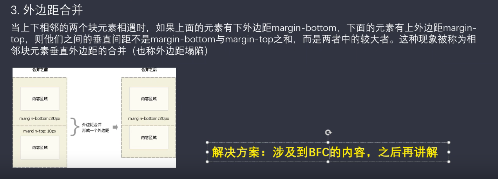
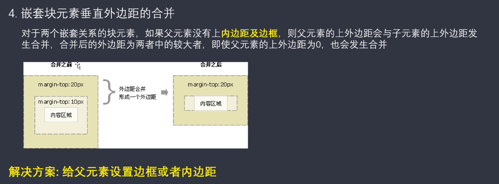
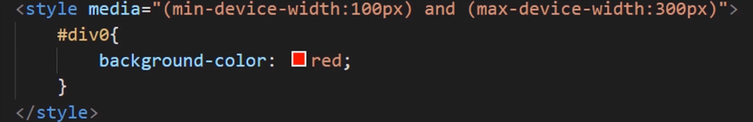
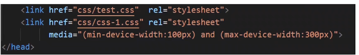

## CSS 初始化

```css
* {
  margin: 0;
  padding: 0;
}
.clearfix:before,
.clearfix:after {
  content: "";
  display: table; /* 触发bfc 防止外边距合并 */
}
.clearfix::after {
  clear: both; /* 清除浮动 */
}
.clearfix {
  *zoom: 1; /* *代表IE6/7能识别的属性,zoom就是IE浏览器清除浮动的方式 */
}
ul {
  list-style: none;
}
```

## 文字间间隔

不要直接设置宽度，设置左右的 `padding`

## absolution 定位

1. 如果父亲没有定位，子级会根据浏览器边框（document 文档）定位

2. 如果父级有定位，子级会依据最近的已经定位（绝对、固定或相对定位的）父元素（祖先）进行定位

## 子绝父相的由来

1. 相对定位 占有位置，不脱标

2. 绝对位置 不占有位置，完全脱标

## 常用固定清除

1. outline:0/none 清除轮廓

2. resize:none 阻止文本域拖拽

## 清除浮动

1. 额外标签法

在浮动元素末尾添加一个空标签，在 style 中加 clear：both

2. 父级加 overflow

父级选择器添加 overflow：hidden/scroll/auto

3. after 伪元素

原理类似第一种方法

4. after 和 before 双伪元素

## 渐变

```css
background-color： liner-gradient（）

background-color： radial-gradient（）

/* 要渐变重复可改成  */
repeating-liner-gradient（）
```

## 动画延迟可以设置为负数

这样一打开页面就已经在播放动画

## 外边距合并

1. 上下元素外边距合并



2. 嵌套块级元素垂直外边距的合并



## 媒体查询

1. 内部样式表内部

```css
@media screen and (min-device-width:400px){
​ .div {
/* ​代码 */
​ }
}
```

2. 内部样式表的 style 内部



3. 外部样式表


