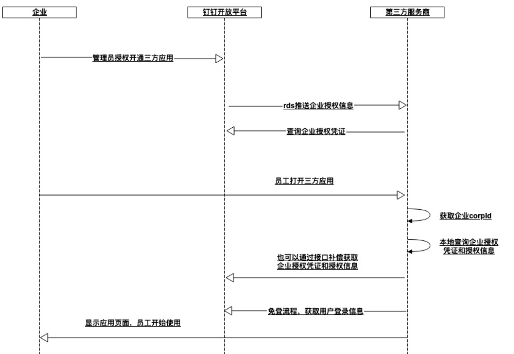
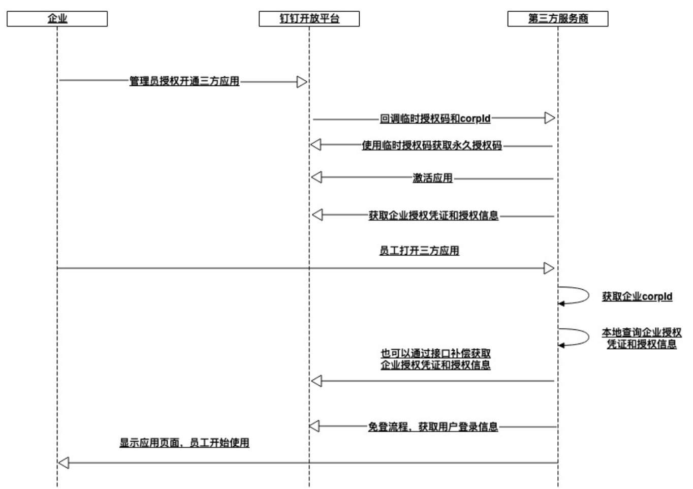

## 链接

[钉钉开放文档](https://open.dingtalk.com/)

[Ding Design](https://ding.design/#/)

[钉钉开发平台](https://open-dev.dingtalk.com/#/)

## 基础

### 钉钉服务端接口
调用钉钉服务端接口时，需使用 HTTPS 协议、JSON 数据格式、UTF-8 编码，POST 请求请在 HTTP Header 中设置 `Content-Type:application/json`。

访问域名为：

新版服务端接口：https://api.dingtalk.com

旧版服务端接口：https://oapi.dingtalk.com

### 第三方企业应用开发

:::warning
给第三方企业开发应用有两种方式
1. 选择第三方企业应用开发,在本组织开发应用后交付第三方企业  

 - 交付方式：
 - 应用不上架，定向定量分发（授权、静默和扫码）。[定向分发](https://open.dingtalk.com/document/isv/application-distribution)
 - 应用上架，天元代下单安装，[天元系统](https://www.yuque.com/xlq/xlq/ssr8nq)。
 - 应用上架，二维码扫码安装。
 - 应用上架，广场下单安装。
 - 应用预装在工作台内，通过工作台分发安装。

2. 选择企业内部应用开发，由第三方企业授权服务商开发
:::

1. 在开发企业第三方应用前，需要完成入驻成为[产品方案商](https://open.dingtalk.com/document/operation-specification/become-an-application-service-provider)。

2. 第三方企业应用必须要注册事件回调,钉钉推送的回调事件：
> RDS数据推送  
> SyncHTTP推送  
> HTTP数据推送（不推荐第三方企业应用使用）  

3. 第三方企业应用需要进行应用授权等开发

4. 第三方企业应用必须接入钉钉免登、通讯录和工作通知能力

5. 开发是H5微应用，需要进行JSAPI鉴权。详情请参考[H5JSAPI鉴权](https://open.dingtalk.com/document/isvapp-client/jsapi-authentication)。
   
## 开发

### 免登开发
免登指企业员工在钉钉内使用第三方企业应用时，无需输入账号密码便可直接登录该应用。建议将用户信息保存在前端缓存（dd.setStorage）或者cookie中，避免每次进入应用都调用钉钉接口进行免登。

免登接入流程如下：

1. 获取免登授权码Code。
PC端暂不支持小程序开发，如果要开发PC端应用，需使用微应用开发方式。
- [小程序获取免登授权码](https://open.dingtalk.com/document/isvapp-client/mini-program-free-login)
- [H5免登流程](https://open.dingtalk.com/document/isvapp-client/logon-free-process)

2. 获取access_token。
通过调用service/get_corp_token接口获取企业授权凭证，详情请参考获取第三方应用授权企业的[accessToken](https://open.dingtalk.com/document/isvapp-server/obtain-the-access_token-of-the-authorized-enterprise)。

3. 获取当前用户的userId。
调用user/getuserinfo接口获取用户的userid，详情请参考[通过免登码获取用户信息](https://open.dingtalk.com/document/isvapp-server/obtain-the-userid-of-a-user-by-using-the-log-free)。

4. 获取当前用户详情。
通过topapi/v2/user/get接口获取用户详情信息，详情请参考[根据userId获取用户详情](https://open.dingtalk.com/document/isvapp-server/query-user-details)。

### 回调函数
[配置回调函数](https://open.dingtalk.com/document/isv/third-party-enterprise-application-address-book-change-event-subscription-process)

### 授权应用开通
:::tip
小程序使用dd.corpId获取企业corpId，微应用由前端从URL中获取。微应用的首页URL，可以使用$CORPID$做为参数占位符，钉钉容器会将$CORPID$替换为当前访问的企业的corpId。例如:https://www.dingtalk.com?corpId=$CORPID$
:::

**RDS推送（聚石塔/钉钉云）和SyncHTTP推送**



**HTTP推送**

HTTP推送方式下，当企业接收到授权开通事件后，需要依次调用以下三个接口完成应用激活，激活完成后才算授权成功：

1. 调用[获取第三方企业应用的suiteAccessToken](https://open.dingtalk.com/document/isvapp-server/obtains-the-suite_acess_token-of-third-party-enterprise-applications)接口获取第三方应用凭证（suite_access_token）。

2. 调用[获取授权企业的永久授权码](https://open.dingtalk.com/document/isvapp-server/obtain-a-permanent-authorization-code)接口获取永久授权码。

3. 调用[激活应用](https://open.dingtalk.com/document/isvapp-server/activate-suite)接口激活企业授权的应用。

HTTP推送方式下，管理员授权开通应用的流程如下图所示。



### 启动时更新
小程序每次冷启动时，都会检查是否有更新版本，如果发现有新版本，将会异步下载新版本的代码包，并同时用客户端本地的包进行启动，即新版本的小程序需要等下一次冷启动才会应用上。如果距离上一次更新版本超过 48 小时，则会等待新版本的代码包被下载后，直接使用新版本启动。

如果需要马上应用最新版本，可以使用dd.UpdateManager()API进行处理。
```js
const updateManager = dd.getUpdateManager()

updateManager.onCheckForUpdate(function (res) {
  // 请求完新版本信息的回调
  console.log(res.hasUpdate) // 是否有更新
})

updateManager.onUpdateReady(function (ret) {
  console.log(ret.version) // 更新版本号
  dd.confirm({
    title: '更新提示',
    content: '新版本已经准备好，是否重启应用？',
    success: function (res) {
      if (res.confirm) {
        // 新的版本已经下载好，调用 applyUpdate 应用新版本并重启
        updateManager.applyUpdate()
      }
    }
  })
})
updateManager.onUpdateFailed(function () {
  // 新版本下载失败
})
```

### App.json

**window**

`window`属性用于设置通用的的状态栏、导航条、标题、窗口背景色。子属性如下表所示：

| **属性**             | **类型**               | **必填** | **描述**                                                   |
| -------------------- | ---------------------- | -------- | ---------------------------------------------------------- |
| titleBarColor        | HexColor               | 否       | 导航栏背景色，HexColor示例：#F5F5F。                       |
| defaultTitle         | String                 | 否       | 页面标题。                                                 |
| defaultTitle_locale  | Dict<Language, String> | 否       | 页面标题的多语言配置。                                     |
| pullRefresh          | Boolean                | 否       | 是否允许下拉刷新，默认为**false**。                        |
| allowsBounceVertical | String                 | 否       | 页面是否支持纵向拽拉超出实际内容，默认为**YES**。          |
| supportColorScheme   | Array                  | 否       | 支持的显示模式，模式有 light和dark 两种。默认为**light**。 |

### tabBar

如果你的小程序是一个多 tab 应用（客户端窗口的底部栏可以切换页面），那么可以通过`tabBar`配置项指定 tab 栏的表现，以及 tab 切换时显示的对应页面。

:::tip
通过页面跳转（`dd.navigateTo`）或者页面重定向（`dd.redirectTo`）所到达的页面，即使它是定义在 tabBar 配置中的页面，也不会显示底部的 tab 栏。另外，tabBar的第一个页面必须是首页。
:::

| **属性**        | **类型**             | **必填** | **描述**                     |
| --------------- | -------------------- | -------- | ---------------------------- |
| textColor       | HexColor             | 否       | 文字颜色。                   |
| selectedColor   | HexColor             | 否       | 选中文字颜色。               |
| backgroundColor | HexColor             | 否       | 背景色。                     |
| items           | Array                | 是       | 每个 tab 配置。              |
| colorSchemes    | Dict<Scheme, Config> | 否       | 显示模式对应的 tabBar 配置。 |

每个 `item` 的属性配置如下表所示:

| **属性**     | **类型**               | **必填** | **描述**                          |
| ------------ | ---------------------- | -------- | --------------------------------- |
| pagePath     | String                 | 是       | 设置页面路径。                    |
| name         | String                 | 是       | 名称。                            |
| name_locale  | Dict<Language, String> | 否       | item名称的多语言配置。            |
| icon         | String                 | 否       | 平常图标路径。                    |
| activeIcon   | String                 | 否       | 高亮图标路径。                    |
| colorSchemes | Dict<Scheme, Config>   | 否       | 显示模式对应的 tabBar Item 配置。 |

:::tip
icon 推荐大小为 60*60px 大小，系统会对任意传入的图片非等比拉伸/缩放。
:::

示例代码：

```json
{
  "tabBar": {
    "textColor": "#dddddd",
    "selectedColor": "#49a9ee",
    "backgroundColor": "#ffffff",
    "items": [
      {
        "pagePath": "pages/index/index",
        "name": "首页"
      },
      {
        "pagePath": "pages/logs/logs",
        "name": "日志"
      }
    ]
  }
}
```

### Page
`Page()`方法的参数说明如下：

| **属性**          | **类型**                | **描述**                                                     |
| ----------------- | ----------------------- | ------------------------------------------------------------ |
| data              | Object or Function      | 初始数据或返回初始化数据的函数。                             |
| onTitleClick      | Function                | 点击标题触发。                                               |
| onPageScroll      | Function({scrollTop})   | 页面滚动时触发。                                             |
| onLoad            | Function(query: Object) | 页面加载时触发。                                             |
| onReady           | Function                | 页面初次渲染完成时触发。                                     |
| onShow            | Function                | 页面显示时触发。                                             |
| onHide            | Function                | 页面隐藏时触发。                                             |
| onUnload          | Function                | 页面卸载时触发。                                             |
| onPullDownRefresh | Function                | 页面下拉时触发。                                             |
| onReachBottom     | Function                | 上拉触底时触发。                                             |
| onShareAppMessage | Function                | 点击右上角分享时触发。                                       |
| 其他              | Any                     | 开发者可以添加任意的函数或属性到 `object`参数中，在页面的函数中可以用 `this`来访问。 |

---

**Page.prototype.$batchedUpdates(callback: Function)**

*说明*

`$batchedUpdates`自1.14.0之后才支持，可以使用`dd.canIUse('page.$batchedUpdates')`做兼容性处理，详情请参考[dd.canIUse](https://open.dingtalk.com/document/app/dd-caniuse#topic-2024690)。

*参数说明*

| **事件** | **类型** | **描述**                               |
| -------- | -------- | -------------------------------------- |
| callback | Function | 在此回调函数中的数据操作会被批量更新。 |

*示例代码*

```js
// pages/index/index.js
Page({
  data: {
    counter: 0,
  },
  plus() {
    setTimeout(() => {
      this.$batchedUpdates(() => {
        this.setData({
          counter: this.data.counter + 1,
        });
        this.setData({
          counter: this.data.counter + 1,
        });
      });
    }, 200);
  },
});
<!-- pages/index/index.axml -->
<view>{{counter}}</view>
<button onTap="plus">+2</button>
```

- 本示例中每次点击按钮，页面的`counter` 会加 2。
- 将 `setData` 放在this.$batchedUpdates中，这样尽管有多次`setData`，但是却只有一次数据的传输。

### AXMl

**import**

`import`可以加载已经定义好的`template`。

例如，在`item.axml`中定义了一个叫`item`的`template`。

```xml
<!-- item.axml -->
<template name="item">
  <text>{{text}}</text>
</template>
```

在`index.axml`中引用`item.axml`，就可以使用`item`模板。

```
<import src="./item.axml"/>
<template is="item" data="{{text: 'forbar'}}"/>
```

`import`有作用域的概念，只会`import`目标文件中定义的`template`。比如，C import B，B import A，在`C`中可以使用`B`定义的`template`，在`B`中可以使用`A`定义的`template`，但是`C`不能使用`A`中定义的`template`。

```xml
<!-- A.axml -->
<template name="A">
  <text> A template </text>
</template>
<!-- B.axml -->
<import src="./a.axml"/>
<template name="B">
  <text> B template </text>
</template>
<!-- C.axml -->
<import src="./b.axml"/>
<template is="A"/>  <!-- Error! Can not use tempalte when not import A. -->
<template is="B"/>
```

注意：template 的子节点只能是一个而不是多个。

允许示例代码：

```xml
<template name="x">
  <view />
</template>
```

不允许示例代码：

```xml
<template name="x">
  <view />
  <view />
</template>
```

**include**

`include`可以将目标文件除了`<template/>`的整个代码引入，相当于是拷贝到`include`位置。

```xml
<!-- index.axml -->
<include src="./header.axml"/>
<view> body </view>
<include src="./footer.axml"/>
<!-- header.axml -->
<view> header </view>
<!-- footer.axml -->
<view> footer </view>
```

AXML提供模板（template），可以在模板中定义代码片段，在不同的地方调用。

:::tip
此处 template 区别于 slot，slot 可参考[开发自定义组件](https://open.dingtalk.com/document/isvapp-client/development-process#topic-2024614)。
:::

**定义模板**

使用`name`属性，作为模板的名字，然后在`<template/>`内定义代码片段。

```xml
<!--
  index: int
  msg: string
  time: string
-->
<template name="msgItem">
  <view>
    <text> {{index}}: {{msg}} </text>
    <text> Time: {{time}} </text>
  </view>
</template>
```

**使用模板**

使用`is`属性，声明需要使用的模板，然后将该模板所需要的`data`传入，例如：

```xml
<template is="msgItem" data="{{...item}}"/>
Page({
  data: {
    item: {
      index: 0,
      msg: 'this is a template',
      time: '2016-09-15'
    }
  }
})
```

`is`属性可以使用`Mustache`语法，来动态决定具体需要渲染哪个模板。

```xml
<template name="odd">
  <view> odd </view>
</template>
<template name="even">
  <view> even </view>
</template>

<block a:for="{{[1, 2, 3, 4, 5]}}">
    <template is="{{item % 2 == 0 ? 'even' : 'odd'}}"/>
</block>
```

**模板作用域**

模板拥有自己的作用域，只能用`data`传入的数据，但可以通过 `onXX` 绑定页面的逻辑处理函数。

推荐用 template 方式来引入模版片段，因为 template 会指定自己的作用域，只使用`data`传入的数据，因此应用会对此进行优化。如果该 template 的 data 没有改变，该片段 UI 并不会重新渲染。

引入路径支持从 node_modules 目录载入第三方模块，例如 page.axml:

```xml
<import src="./a.axml"/> <!-- 相对路径 -->
<import src="/a.axml"/> <!-- 项目绝对路径 -->
<import src="third-party/x.axml"/> <!-- 第三方 npm 包路径 -->
```

### SJS

| **属性** | **类型** | **是否必填** | **说明**                          |
| -------- | -------- | ------------ | --------------------------------- |
| name     | String   | 是           | 当前`<import-sjs>` 标签的模块名。 |
| from     | String   | 是           | 引用 .sjs 文件的相对路径。        |

:::tip
- sjs 中只支持使用 import、export 管理模块依赖。
- sjs 只能定义在 `.sjs`文件中，然后在 axml 中使用 `<import-sjs>`标签引入。
- sjs 可以调用其他 sjs 文件中定义的函数。
- sjs 是 JavaScript 语言的子集，请勿将其等同于 JavaScript。
- sjs 的运行环境和其他 JavaScript 代码是隔离的，sjs 中不能调用其他 JavaScript 文件中定义的函数，也不能调用小程序提供的 API。
- sjs 函数不能作为组件事件回调。
- sjs 不依赖于基础库版本，可以在所有版本小程序中运行。
:::

**使用方式**

在 index.sjs 文件中定义 SJS：

```javascript
// pages/index/index.sjs
const message = 'hello dingtalk';
const getMsg = x => x;
export default {
  message,
  getMsg,
};
```

index.js示例代码：

```javascript
// pages/index/index.js
Page({
  data: {
    msg: 'hello taobao',
  },
});
```

index.axml示例代码：

```xml
<!-- pages/index/index.axml -->
<import-sjs name="m1" from="./index.sjs"/>
<view>{{m1.message}}</view>
<view>{{m1.getMsg(msg)}}</view>
```

页面输出：

```javascript
hello dingtalk
hello taobao
```

### 授权登录

[统一授权套件](https://open.dingtalk.com/document/isvapp-client/overview)

### 开发流程

准备工作：
1. 入驻成为产品方案商，详情参见文档入驻成为产品方案商。
2. 需要成为钉钉开发者，详情参见成为钉钉开发者

