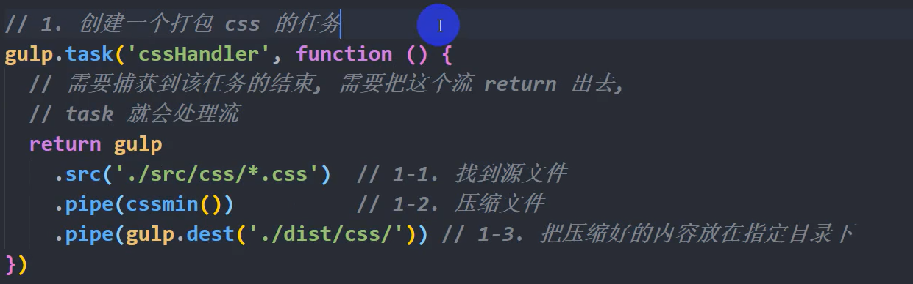
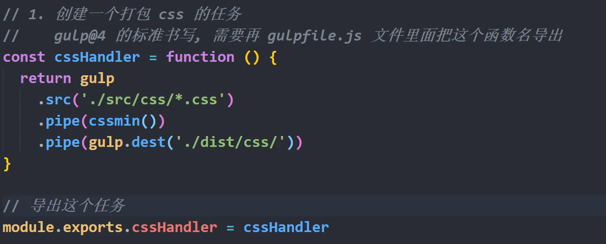

[Webpack](http://xxpromise.gitee.io/webpack5-docs)

## 什么是流

流文件：流

> 一种文件传输的格式
> 一段一段的文件传输

流格式：流

> 从头到尾的一个过程
> 需要从源开始步步经过加工
> 每一个步骤需要依赖上一步的结果
> 最终给出一个完整的成品

gulp 是基于流格式的一种打包构建工具

gulp 的依赖环境

> 依赖于 node 环境进行开发
> 底层封装的内容就是 node 里面的读写文件

## gulp 的作用

对于 css 文件

> 压缩
> 转码(自动添加前缀)

对于 js 文件

> 压缩
> 转码(ES6 转 ES5)

对于 html 文件

> 压缩
> 转码(对格式的转换)

对于静态资源文件的处理

对于第三方文件的处理

## gulpfile.js

gulp 进行打包的依据,每一个项目需要一个 gulpfile.js，在这个文件里面进行本项目的打包配置，gulp 再运行的时候，会自动读取 gulpfile.js 文件里面的配置，按照 gulpfile.js 文件里面的配置进行打包工作
:::tip
直接写在项目根目录，和 src 同级
:::

## API

### gulp.task()

> 语法：gulp.task(任务名称，任务处理函数)
>
> 作用：创建一个基于流的任务
>
> 例子：
>
> ```js
> gulp.task('htmlHandler'，function() {
> //找到html源文件，进行压缩，打包，放入指定目录
> })
> ```

### gulp.src()

> 语法：gulp.src(路径信息)
>
> 作用：找到源文件
>
> ```js
> // 找到指定一个文件
> gulp.src("./a/b.html");
>
> // 找到指定目录下，指定后缀的文件
> gulp.src("。/a/*.html");
>
> // 找到指令目录下的所有文件
> gulp.src("./a/**");
>
> // 找到a目录下所有子目录里面的所有文件
> gulp.src("./a/**/*!");
> gulp.src("./a/**/*.htm1");
> ```

### gulp.dest()

> 语法：gulp.dest(路径信息)
>
> 作用：把一个内容放入指定目录内
>
> ```js
> gulp.dest("./abc");
> ```

### gulp.watch()

> 语法：gulp.watch(路径信息，任务名称)
>
> 作用：监控指定目录下的文件，一旦发生变化，重新执行后面的任务
>
> ```js
> // 当指定目录下的htm1文件发生变化，就会执行htmlHandler这个任务
> gulp.watch('./src/pages/*.htm1'，htmlHandler)
> ```

### gulp.series()

> 语法：gulp.series(任务 1，任务 2，任务 3，..)
>
> 作用：逐个执行多个任务，前一个任务结束，第二个任务开始

### gulp.parallel()

> 语法：gulp.parallel(任务 1，任务 2，任务 3，…)
>
> 作用：并行开始多个任务

### pipe()

> 管道函数
>
> 所有的 gulpAPI 都是基于流
>
> 接收当前流，进入下一个流过程的管道函数
>
> ```js
> gulp.src().pipe(压缩任务).pipe(转码).pipe(gulp.dest("abc"));
> ```

## 插件

### 1.gulp-cssmin

下载：

```bash
npm i gulp-cssmin -D
```

导入：

```js
const cssmin = require("gulp-cssmin");
```

导入以后得到一个处理流文件的函数,直接再管道函数里面执行就好了

### 2.gulp-autoprefixer

下载：

```bash
npm i gulp-autoprefixer-D
```

导入：

```js
const autoprefixer = require("gulp-autoprefixer");
```

导入以后得到一个处理流文件的函数,直接再管道函数里面使用，需要传递参数

`{browers:[要兼容的浏览器格式]}`

可以现在 package.json 文件进行浏览器的配置

```json
"broswerslist":["last 2 version"]
```

### 3.gulp-sass

需要下载第三方库 sass

```js
const sass = require("gulp-sass")(require("sass"));
```

### 4.gulp-uglify

压缩 Js 文件
下载：

```bash
npmi-D gulp-uglify
```

导入：

```js
const uglify = require("gulp-uglify");
```

导入以后得到一个可以处理流文件的函数,直接再管道函数中使用就可以了
:::tip
你不能写 ES6 语法，一旦有了 ES6 语法就会报错
:::

### 5.gulp-babel

专门进行 ES6 转 ES5 的插件

gulp-babel 的版本

gulp-babe107：大部分使用再 gulp@3 里面->gulp-babe1@8：大部分使用再 gulp@4 里面

下载：

> gulp-babe1 需要依赖另外两个包，要一起下载
>
> 另外两个包：@babe1/core@babel/preset-env

导入：
只要导入一个包就够了，他会自动导入另外两个包

```js
const babel = require("gulp-babel");
```

导入以后得到一个可以处理流文件的函数，直接再管道函数内部使用，需要传递参数

### 6.gulp-htmlmin

下载：

```bash
npm i -D gulp-htmlmin
```

导入：

```js
const htmlmin = require("gulp-htmlmin");
```

导入以后得到一个可以处理流文件的函数，直接再管道函数里面调用，需要传递参数

### 7.del

下载：

```bash
npm i -D del
```

作用：删除文件目录

导入：

```js
const del = require("del");
```

导入以后得到一个函数，直接使用传递参数就可以了

### 8.gulp-webserver

作用：启动一个基于 node 书写的服务器

下载：

```bash
npm i -D gulp-webserver
```

导入：

```js
const webserver = require("gulp-webserver");
```

### 9.gulp-file-include

作用：再一个 html 页面里面导入一个 html 片段

下载：

```bash
npm i -D gulp-file-include
```

导入

```js
const fileInclude = require("gulp-file-include");
```

### 执行一个 gulp 配置好的任务

直接打开命令行，切换到`gulpfile.js`所在的目录,执行指令`$gulp`任务名称

## 图片问题

在开发环境中，图片是不需要我们压缩的，直接使用线上地址，图片是 UI 处理好给我们的 gulp-imagemin，专门用来压缩图片(无损压缩)，下载需要很好的网络环境，压缩程度最高是 7 级，1024K 变成 1023|

## 默认任务为什么一定要叫做 default

因为你使用 `gulp` 指令的时候,是`$gulp <任务名称>`

当你有一个叫做 `default` 的任务的时候,直接执行指令`$gulp`，他会自动去指定 `gulpfile.js` 文件中的 `default` 任务

## gulp@3.0



## gulp@4.0



## 实例代码

```javascript
// 0. 导入第三方
// 0-1. 导入gulp
const gulp = require("gulp");
// 0-2. 导入gulp-cssmin
const cssmin = require("gulp-cssmin");
// 0-3. 导入gulp-autoprefixer
const autoprefixer = require("gulp-autoprefixer");
// 0-4. 导入gulp-sass
// const sass = require('gulp-sass');ndeo-sass已经弃用
const sass = require("gulp-sass")(require("sass"));
// 0-5. 导入gulp-uglify
const uglify = require("gulp-uglify");
// 0-6. 导入gulp-babel
const babel = require("gulp-babel");
// 0-7. 导入gulp-htmlmin
const htmlmin = require("gulp-htmlmin");
// 0-8. 导入del
const del = require("del");
// 0-9. 导入gulp-webserver
const webserver = require("gulp-webserver");
// 0-10. 导入gulp-file-include
const fileInclude = require("gulp-file-include");

// 1. 创建任务
// 1-1. 创建一个打包css的任务(gulp@3.0)
// gulp.task('cssHandeler', function () {
//     // 需要捕获到该任务的结束，需要把这个流return出去
//     // task会处理流
//     return gulp
//         .src('./src/css/*.css')
//         .pipe(autoprefixer({ browsers: ['last 2 version'] }))
//         .pipe(cssmin())
//         .pipe(gulp.dest('./dist/css/'))
// })

// 1-1. 创建一个打包css的任务(gulp@4.0)
const cssHandler = function () {
  // 需要捕获到该任务的结束，需要把这个流return出去
  // task会处理流
  return (
    gulp
      .src("./src/css/*.css") // 1. 找到源文件路径
      //.pipe(autoprefixer({ browsers: ['last 2 version'] }))   // 最近两个版本
      .pipe(autoprefixer()) // 在package.json文件中已经设置好了这边可以省略
      .pipe(cssmin()) // 3. 压缩
      .pipe(gulp.dest("./dist/css/"))
  ); // 4. 指定输出路径
};

// 1-2. 创建一个打包sass文件的任务
const sassHandler = function () {
  return gulp
    .src("./src/sass/*.scss")
    .pipe(sass())
    .pipe(autoprefixer())
    .pipe(cssmin()) // 3. 压缩
    .pipe(gulp.dest("./dist/sass/")); // 4. 指定输出路径
};

// 1-3. 创建一个打包js文件的任务
const jsHandler = function () {
  return gulp
    .src("./src/js/*.js")
    .pipe(
      babel({
        // babel@7 ,presets:['es2015]
        presets: ["@babel/env"],
      })
    )
    .pipe(uglify())
    .pipe(gulp.dest("./dist/js/"));
};

//1-4. 创建一个打包html文件的任务
const htmlHandler = function () {
  return gulp
    .src("./src/pages/*.html")
    .pipe(
      fileInclude({
        // 根据你的配置导入对应的html片段
        prefix: "@-@", // 定义的标识符
        basepath: "./src/components", // 基准目录，组件的位置
      })
    )
    .pipe(
      htmlmin({
        // 通过配置的参数进行压缩
        collapseWhitespace: true, // 表示移除空格
        removeEmptyAttributes: true, // 表示移除空的属性(仅限于原生属性)
        collapseBooleanAttributes: true, // 移除类似checked的布尔值属性
        removeAttributeQuotes: true, // 移除属性上的双引号
        minifyCSS: true, // 压缩内嵌式css(只能基本压缩，不能添加前缀)
        minifyJS: true, // 压缩内嵌式js(只能基本压缩，不能转码)
        removeStyleLinkTypeAttributes: true, // 移除style和link标签的上type属性
        removeScriptTypeAttributes: true, // 移除script标签的上type属性
      })
    )
    .pipe(gulp.dest("./dist/pages/"));
};

//1-5. 创建一个打包image文件的任务
const imageHandler = function () {
  return gulp.src("./src/images/**").pipe(gulp.dest("./dist/iamges/"));
};

//1-6. 创建一个打包videos文件的任务
const videoHandler = function () {
  return gulp.src("./src/vidoes/**").pipe(gulp.dest("./dist/videos/"));
};

//1-7. 创建一个打包图片文件的任务
const audioHandler = function () {
  return gulp.src("./src/audios/**").pipe(gulp.dest("./dist/audios/"));
};

//1-8. 创建一个打包第三方库文件的任务
const libHandler = function () {
  return gulp.src("./src/lib/**").pipe(gulp.dest("./dist/lib/"));
};

//1-9. 创建一个打包fonts文件的任务
const fontHandler = function () {
  return gulp.src("./src/fonts/**").pipe(gulp.dest("./dist/fonts/"));
};

//1-10. 创建一个删除dist目录的任务
const delHandler = function () {
  return del(["./dist/"]);
};

//1-11. 创建一个启动服务器的任务
const webHandler = function () {
  return gulp.src("./dist/").pipe(
    webserver({
      host: "localhost",
      port: "8080",
      livereload: true,
      open: "./pages/index.html",
      proxies: [
        // 配置所有代理
        // 每一个代理就是一个对象数据类型
        {
          // 代理标识符
          source: "/bd",
          // 代理目标地址
          target: "http://www.baidu.com",
        },
      ],
    })
  );
};

//1-12. 创建一个监控的任务
const watchHandler = function () {
  gulp.watch("./src/sass/*.scss", sassHandler);
  gulp.watch("./src/css/*.css", cssHandler);
  gulp.watch("./src/js/*.js", jsHandler);
  gulp.watch("./src/pages/*.html", htmlHandler);
};

//2. 导出这个任务
//2-1. 导出打包css的任务
module.exports.cssHandler = cssHandler;
//2-2. 导出打包sass的任务
module.exports.sassHandler = sassHandler;
//2-3. 导出打包js的任务
module.exports.jsHandler = jsHandler;
//2-4. 导出打包html的任务
module.exports.htmlHandler = htmlHandler;
//2-5. 导出打包iamge的任务
module.exports.imageHandler = imageHandler;
//2-6. 导出打包videp的任务
module.exports.videoHandler = videoHandler;
//2-7. 导出打包audio的任务
module.exports.audioHandler = audioHandler;
//2-8. 导出打包lib的任务
module.exports.libHandler = libHandler;
//2-9. 导出打包fonts的任务
module.exports.fontHandler = fontHandler;
//2-10. 导出删除dist目录的任务
module.exports.delHandler = delHandler;
//2-11. 导出服务器的任务
module.exports.webHandler = webHandler;

// 3.  配置默认任务
//  gulp.series() 或者 gulp.parallel()
//  前者执行有先后顺序，后者没有
//  两个方法的返回值就是一个函数，返回值可以直接被当作任务函数使用
//  使用task的方式创建一个default任务

// 方式一：
// gulp.task('default', () >  {});

// const res = gulp.parallel(cssHandler, sassHandler, jsHandler);
// module.exports.default = res;

// 方式二:
// module.exports.default = gulp.parallel(cssHandler, sassHandler, jsHandler, htmlHandler,
//     imageHandler, videoHandler, audioHandler, libHandler, fontHandler);

//添加删除dist任务，再执行后面任务
// module.exports.default = gulp.series(
//     delHandler,
//     gulp.parallel(cssHandler, sassHandler, jsHandler, htmlHandler,
//         imageHandler, videoHandler, audioHandler, libHandler, fontHandler)
// )

// 添加完服务器后
module.exports.default = gulp.series(
  delHandler,
  gulp.parallel(
    cssHandler,
    sassHandler,
    jsHandler,
    htmlHandler,
    imageHandler,
    videoHandler,
    audioHandler,
    libHandler,
    fontHandler
  ),
  webHandler,
  watchHandler
);
```
