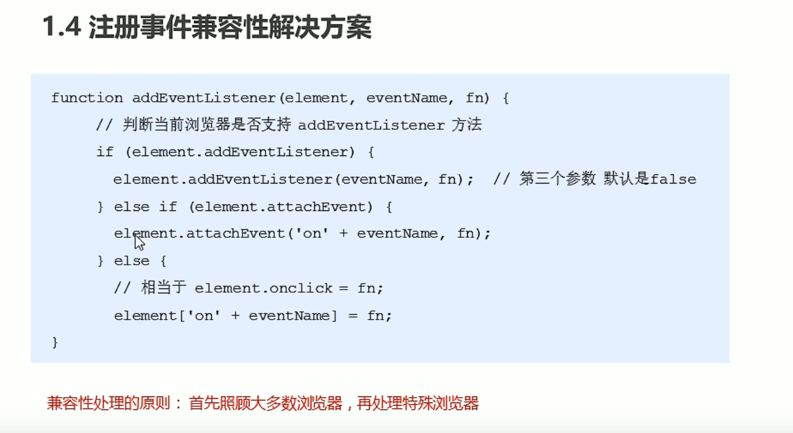
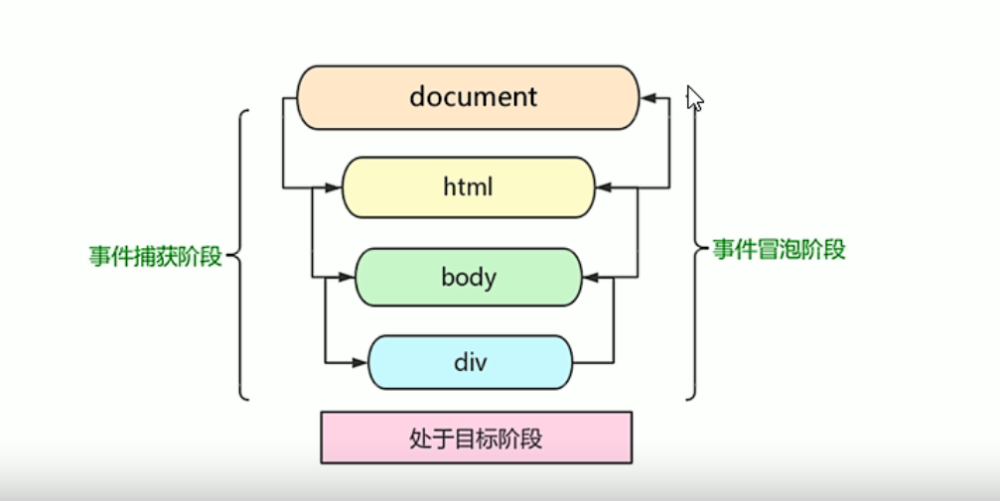
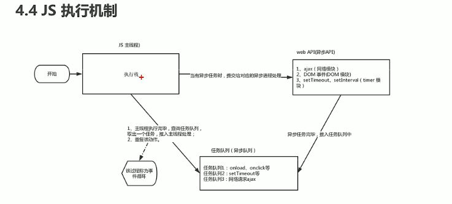
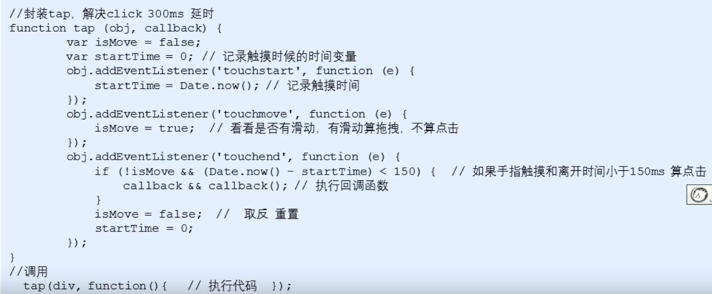
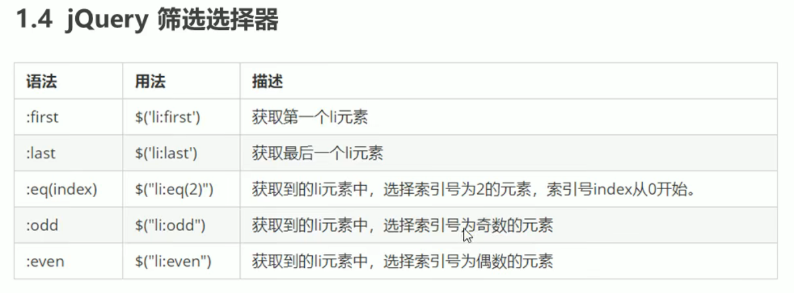
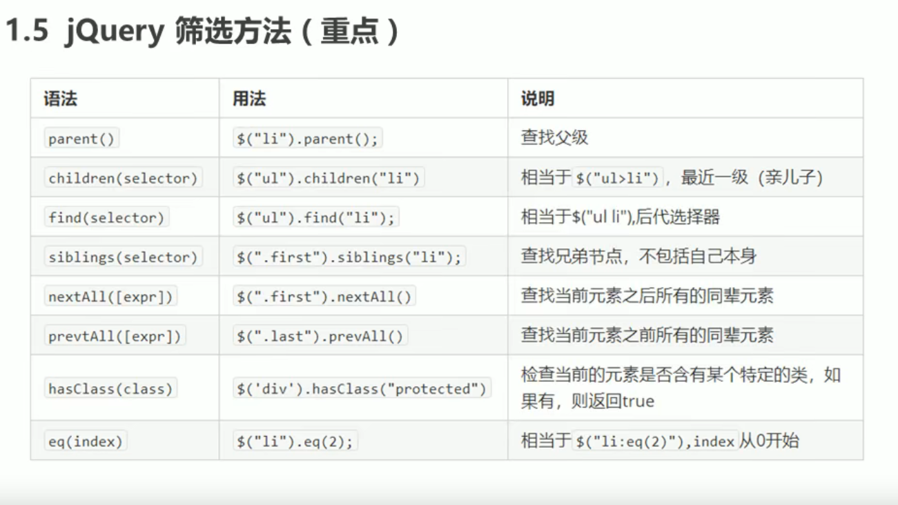
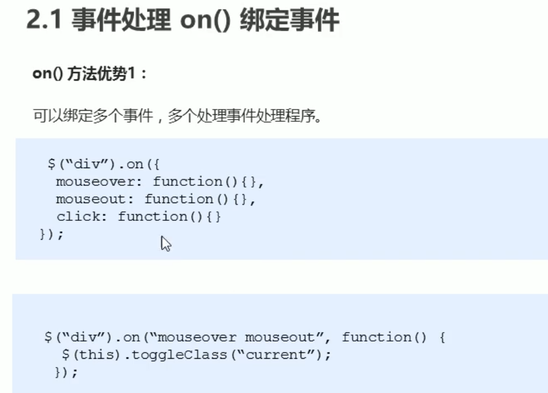
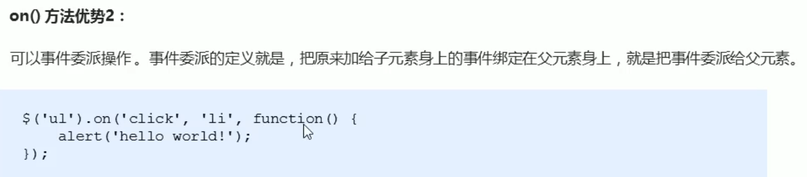

# ECMAScript

## 杂乱
```javascript
console.log()
console.dir()	//打印返回的元素对象
alert()
str.length;	//求字符串长度
typeof str	//求数据类型
```

:::tip
1. 对象有属性__proto__，指向该对象的构造函数的原型对象。
2. 方法除了有属性__proto__，还有属性prototype，prototype指向该方法的原型对象。</br>
:::

### 数据转化
```javascript
//字符串转化
num.toString()	
//字符串转化
String(num)		
//数值转化求整
parseInt(age)	
//数值转化求小数
parseFloat(age)	
//数值强制转化
Number(age)		
// js数值隐式转化(- * /)如：
'12' - 0
//布尔型转化
Boolean(str)		
//求数组长度
array.length		
```
## 内置对象

### Math
```javascript
// 向下取整
Math.floor(1.2);	//1
// 向上取整
Math.ceil(1.1);	//2
// 四舍五入
Math.round(1.5);	//2
```

### Date
```javascript
var date = new Date("2022-5-2");
console.log(date.getFullYear());	//获取当前日期的年
console.log(date.getMonth() + 1);	//获取当月(0-11)月份要加一
console.log(date.getDate());	    //获取几号
console.log(date.getDayr());	    //获取周几(周日0到周六6)
console.log(date.getHours());	    //获取小时
console.log(date.getMinutes());	    //获取分钟
console.log(date.getSeconds());	    //获取秒钟
console.log(date.valueOf());	    //获取当前时间距离970年1月1日的毫秒数
console.log(date.getTime());	    //获取当前时间距离970年1月1日的毫秒数
console.log(Date.now());	        //获取当前时间距离970年1月1日的毫秒数
var data1 = +new Date();	        //获取总的毫秒数
// 总秒数转化为天、时、分、秒
d= parselnt(总秒数/60/60/24);	//计算天数
h= parselnt(总秒数/60/60%24);	//计算小时
m = parselnt(总秒数/60%60);	    //计算分数
s = parselnt(总秒数%60);	    //计算当前秒数
```

### 数组
```javascript
// 判断是否为数组
var arr = [];
console.log(arr instanceof Array);	//true
console.log(Array.isArray(arr));	//true

arr.push()	//在数组末尾追加新元素，返回值是新数组的长度
arr.unshift()	//在数组前面追加新元素，返回值是新数组的长度
arr.pop()	//在数组最后面删除元素，返回值是删除的元素
arr.shift()	//在数组最前面删除元素，返回值是删除的元素
arr.reverse();	//翻转数组
arr.splice(index,num)	//在数组arr中从index开始，删除num个数据
arr.sort();	//数组排序

// sort的排序会导致出现	1，17，3，33，4
// 解决办法：
arr.sort(function(a,b){
    return a-b;	     //升序的顺序排列
    //return b-a;    //降序的顺序排列
});

arr.indexxOf('blue');	    //返回该元素在数组中的下标,找不到返回-1
arr.lastIndexOf('blue');	//从后面查找返回该元素在数组中的下标,找不到返回-1

// 数组转化为字符串
arr.toString();	    //分隔符为逗号
arr.join('-');	    //指定分隔符
arr1.concat(arr2);	//concat()方法用于合并两个或多个数组，返回一个新数组
```

### 字符
```javascript
// 根据位置返回字符
str.charAt(index)	//返回指定位置的字符
str.charCodeAt(index)	//获取指定位置字符的Ascall码
str[index]

// 方法用于连接两个或多个字符串。拼接字符串，等效于+
concat(str1，str2，str3...)concat()
// 从start位置开始(索引号)，length取的个数
substr(start，length)
// 从start位置开始，截取到end位置，end取不到(他们俩都是索引号)
slice(start，end)
// 从start位置开始，截取到end位置，end取不到 基本和slice相同 但是不接受负值
substring(start，end)

str.replace('','');
str.split(',');
```
### 插件

轮播图：swiper

click延时：fastclick

superslide

iscroll

移动端视频插件：zy.media.js

### 进制表示
```javascript
八进制：var num = 010; 	// 加个0就表示八进制

十六进制：var num = 0x10; 	// 加个0x就表示八进制

alert(Number.MAX_VAULE) ;

alert(Number.MIN_VAULE) 	//数字型的范围
```
### 预解析

预解析会把 js 里面所有的 `var` 和 `function` 提升到当前作用域的前面

## 对象 
### 创建对象
1. 直接创建
```javascript
var obj = {
    name: "sun",
    sayHi: function {
        console.log("hi");
    }
};
```
1. 里面的属性或者方法我们采取键值对的形式   `键 ：值`</br>
2. 多个属性或者方法中间用逗号隔开的</br>
3. 方法冒号后面跟的是一个匿名函数</br>

> 调用方法
> 1. 对象名.属性名
> 2. 对象名['属性名']

2. new创建
```javascript
var  obj = new Object();
​obj.name = "sun";
```
3. 构造函数
```javascript
function Star(uname) {
    this.name = uname;
    this.sing = function(song){
        console.log(song)
        }
    }
var ldh  = new Star('ldh');
ldh.sing('music');
```

### 遍历对象
```javascript
for (var k in obj) {
    console.log(k);	//得到的是属性名
    console.log(obj[k]);	//属性值
}
```

# DOM

## 获取元素

### 1、根据ID获取
```javascript
document.getElementById("id")
```
### 2、根据标签名获取
```javascript
//返回带有指定标签名的对象的集合
getElementsByTagName("tagName")	
```
> 获取父元素下的子元素
> 需要先获取父元素，再获取子元素
> ```javascript
> var parent = document.getElementById('parent');
> var chiid = parent[0].getElemenstByTagName('li');
> ```

### 3 、根据类名
```javascript
getElementsByClassName("");
```
### 4、括号里可以输入选择器
```javascript
querySelector("#nav")	//返回指定选择器的第一个元素对象
querySelectorAll('选择器')	//返回指定选择器的所有元素对象
```
### 5、特殊
获取body</br>
`document.body`

获取html</br>
`document.documentElement`

## 事件

事件源、事件类型、事件处理程序
```javascript
var btn = document.getElementById('btn');
btn.onclick = function(){
    alert("被触发");
};
```
### 鼠标事件
| 鼠标事件     | 触发条件             |
| ------------ | -------------------- |
| onclick      | 鼠标点击左键触发     |
| onmouseover  | 鼠标经过触发         |
| onmouseout   | 鼠标离开触发         |
| onmouseenter | 鼠标经过触发(无冒泡) |
| onmouseleave | 鼠标离开触发(无冒泡) |
| onfocus      | 获得鼠标焦点触发     |
| onblur       | 失去鼠标焦点触发     |
| onmousemove  | 鼠标移动触发         |
| onmouseup    | 鼠标弹起触发         |
| onmousedown  | 鼠标按下触发         |

1. 禁止鼠标右键菜单
`contextmenu` 主要控制应该何时显示上下文菜单，主要用于取消默认的上下文菜单
```javascript
document.addEventListener('contextmenu'，function(e){
    e.preventDefault();
} 
```
2. 禁止鼠标选中(selectstart开始选中)
```javascript
document.addEventListener('selectstart'，function(e){
​	e.preventDefault();
}
```

### 键盘事件

| 键盘事件   | 触发条件                                                     |
| ---------- | ------------------------------------------------------------ |
| onkeyup    | 某个键盘按键被松开时触发                                     |
| onkeydown  | 某个键盘按键被按下时触发                                     |
| onkeypress | 某个键盘按键被按下时触发 但是它不识别功能键比如ctrl shift箭头等 |

:::tip
`keyup` 和 `keydown` 不区分键盘大小写</br>
`keypress` 区分键盘大小写</br>
:::

### change事件

### 改变元素内容

> element.innerText 从起始位置到终止位置的内容，但它去除html标签，同时空格和换行也会去掉element.innerHTML 起始位置到终止位置的全部内容，包括html标签，同时保留空格和换行

> element.style.属性	行内样式表操作(驼峰命名法)一次改变一个属性

> element.className	类名样式表操作	得先在css写类样式

### 获取元素的属性值

1. element.属性	 系统自带属性

2. element.getAttribute('属性')	 *自定义的属性*
:::tip
自定义属性，默认以`data-`开头

获取H5自定义属性
1. 兼容性获取 element.getAttribute('data-index');
2. H5新增 element.dataset.index 或者 element.dataset['index'],ie 11才开始支持,只能以data开头

针对data开头的属性，如果自定义属性里面有多个-链接的单词，我们获取的时候采取驼峰命名法

html:
```html
<div data-list-name="andy"></div>
```
js:
```javascript
var div = document.querySelector('div');
console.log(div.dataset.listName);	
// 或者div.dataset['listName']
```
:::

```javascript
element.setAttributes("属性","属性值")		//更改属性
element.removeAttributes("属性","属性值")	//移除属性
```

## 节点

一般地，节点至少拥有`nodeType`(节点类型)、`nodeName`(节点名称)和`nodeValue`(节点值)这三个基木属性。

> 元素节点`nodeType`为1</br>
> 属性节点`nodeType` 为2</br>
> 文本节点`nodeType` 为3(文本节点包含文字、空格、换行等)</br>

### 结点层级

#### 父级节点

`node.parentNode`</br>
parentNode属性可返回某节点的父节点，注意是最近的一个父节点。
如果指定的节点没有父节点则返回`null`

#### 子节点

1. `parentNode.childNodes`(标准)</br>
parentNode.childNodes返回包含指定节点的子节点的集合，该集合为即时更新的集合。
注意：返回值里面包含了所有的子节点，包括元素节点，文本节点等。
如果只想要获得里面的元素节点，则需要专门处理。所以我们一般不提倡使用childNodes。

1. `parentNode.children`(非标准)</br>
`parentNode.children`是一个只读属性，返回所有的子元素节点。它只返回子元素节点，其余节点不返回。
`node.firstChild`获取第一个节点，不管是文本节点，不管是文本节点还是元素节点。
`node.firstElementChild`获取第一个子元素，注意兼容性。

#### 兄弟节点

1. `node.nextSibling` 返回当前元素的下一个兄弟节点，找不到则返回`null`。同样，也是包含所有的节点。
2. `node.previousSibling` 返回当前元素上一个兄弟节点，找不到则返回`null`。同样，也是包含所有的节点。
3. `node.nextElementsibling` 返回当前元素下一个兄弟元素节点，找不到则返回`null`。
4. `node.previousElementsibling` 返回当前元素上一个兄弟节点，找不到则返回`null`。
> 注意：这两个方法有兼容性问题，IE9以上才支持。

```javascript
function getNextElementsibling (element) {
	var el = element; 
	while (el = el. nextSibling) {
    	if (el. nodeType == 1)
			return el;}
	return null;}
```

### 创建节点

1. `document.createElement('tagName')`</br>
document.createElement()方法创建由 tagName指定的HTML元素。因为这些元素原先不存在，是根据我们的需求动态生成的，所以我们也称为动态创建元素节点。

2. `document.write('<div>123</div>')`</br>
document.write是直接将内容写入页面的内容流，但是文档流执行完毕，则它会导致页面全部重绘

> 区别</br>
> 1.document.write是直接将内容写入页面的内容流，但是文档流执行完毕，则它会导致页面全部重绘。</br>
> 2.innerHTML是将内容写入某个DOM节点，不会导致页面全部重绘3.innerHTML 创建多个元素效率更高(不要拼接字符串，采取数组形式拼接)，结构稍微复杂。</br>
> 4.createElement()创建多个元素效率稍低一点点，但是结构更清晰总结：不同浏览器下，innerHTML效率要比 creatElement高。</br>
> ```javascript
> var arr =[];
> for(var i= e;i <= 100;i++){
> ​     arr.push(<a></a>);}
> inner.innerHTML = arr.join('');
> ```

### 添加节点

1. `node.appendChild(child)`</br>
`node.appendchild()`方法将一个节点添加到指定父节点的子节点列表末尾。类似于css里面的after 伪元素。

2. `node.insertBefore(child，指定元素)`</br>
`node.insertBefore()`方法将一个节点添加到父节点的指定子节点前面。类似于css里面的before伪元素。

### 删除节点

1. `node.removeChild(child)`</br>
`node.removechild()`方法从DOM中删除一个子节点，返回删除的节点。

### 复制节点(克隆节点)

1. `node.cloneNode()`</br>
`node.cloneNode()`方法返回调用该方法的节点的一个副本，也称为克隆节点/拷贝节点。
:::warning
1. node.cloneNode();括号为空或者里面是false 浅拷贝 只复制标签不复制里面的内容
2. node.cloneNode(true);号为true深拷贝 复制标签复制里面的内容
:::

### 阻止链接跳转

添加  `javascript:void(0);` 或者`javascript:;`
```html
<a href='javascript:void(0);'></a>
```

### addEventListener

`eventTarget.addEventListener(type，listener[,usecapture])`	//调用函数不用加小括号
`eventTarget.addEventListener()`方法将指定的监听器注册到eventTarget(目标对象)上，当该对象触发指定的事件时，就会执行事件处理函数。
该方法接收三个参数：
1. `type`：事件类型字符串，比如`click`，`mouseover`，注意这里不要带`on`。
2. `listener`：事件处理函数，事件发生时，会调用该监听函数。
3. `useCapture`：可选参数，是一个布尔值，默认是false。

`attachEvent` (I9以前)


### 移除事件
```javascript
div.onclick = null;
div.removeEventListener('click',fn);
div.detachEvent('onclick',fn);
```


### 事件对象

1. `event` 就是一个事件对象，写到侦听函数的小括号里面，当形参来看
2. 事件对象只有有了事件才会存在，它是系统自动创建的，不需要传递参数
3. 事件对象是事件的一系列相关数据的集合 跟事件相关的比如鼠标点击里面就包含了鼠标的相关信息，鼠标坐标，如果是键盘事件里面就是键盘事件的信息，比如判断用户按下了那个键
4. 这个事件对象可以自己命名，比如event、evt、e</br>
兼容处理：`e = e || window.enent`

### 事件对象的常见属性和方法

| 事件对象属性方法      | 说明                                                         |
| --------------------- | ------------------------------------------------------------ |
| e.target              | 返回触发事件的对象                           标准            |
| e.srcElement          | 返回触发事件的对象非标准ie6-8使用        非标准   ie6-8使用  |
| e.type                | 返回事件的类型 比如 click mouseover不带on                    |
| e.returnValue         | 该属性 阻止默认事件(默认行为)非标准ie6-8   使用比如不让链接跳转 |
| e.preventDefault()  | 该方法 阻止默认事件(默认行为)标准 比如不让链接跳转         |
| e.stopPropagation() | 阻止冒泡  标准                                               |
| e.cancelBubble        | 该属性阻止冒泡   非标准   ie6-8使用                          |
| e.keycode             | 返回改建的ASCALL码                                           |

1. `e.target` 返回的是触发事件的对象(元素)this 返回的是绑定事件的对象(元素)</br>
区别：`e.target` 点击了那个元素，就返回那个元素</br>
this那个元素绑定了这个点击事件，那么就返回谁</br>
2. `e.currentTarget` 和 `this` 相似，但 ie678 不认识
3. `return false` 也可以不让链接跳转，只适用于传统

### 事件委托

事件委托也称为事件代理，在jQuery里面称为事件委派。

> 事件委托的原理
> 不是每个子节点单独设置事件监听器，而是事件监听器设置在其父节点上，然后利用冒泡原理影响设置每个子节点。
> 以上案例：给ul注册点击事件，然后利用事件对象的target来找到当前点击的li，因为点击li，事件会冒泡到ul上，ul有注册事件，就会触发事件监听器。

事件委托的作用
**我们只操作了一次DOM，提高了程序的性能**

### 鼠标事件对象

`event` 对象代表事件的状态，跟事件相关的一系列信息的集合。

| 鼠标事件对象 | 说明                                  |
| ------------ | ------------------------------------- |
| e.clientX    | 返回鼠标相对于浏览器窗口可视区的X坐标 |
| e.clientY    | 返回鼠标相对于浏览器窗口可视区的Y坐标 |
| e.pageX      | 返回鼠标相对于文档页面的X坐标IE9+支持 |
| e.pageY      | 返回鼠标相对于文档页面的Y坐标IE9+支持 |
| e.screenX    | 返回鼠标相对于电脑屏幕的X坐标         |
| e.screen     | 返回鼠标相对于电脑屏幕的Y坐标         |

### 杂乱

文本框获得焦点：`text.focus()`

注意：`keydown` 和 `keypress` 在文本框里面的特点：他们两个事件触发的时候，文字还没有落入文本框中。`keyup` 事件触发的时候，文字已经落入文本框里面了。

`this`指向当前函数或方法运行时所在的对象
```javascript
var age = 20;
var obj = {
    age: this.age
}
```

改变 `this` 指向的对象
`call` ，`apply`(参数跟数组)，`bind()` 返回的是函数，后面加小括号

运行脚本就是在调用一个`window`函数

# BOM(浏览器对象模型)

## window对象的常见事件

### 窗口加载事件

```javascript
window.onload = function(){}	
window.addEventListener("load"，function(){} )
```

`window.onload` 是窗口页面加载事件，当文档内容完全加载完成会触发该事件(包括图像、脚本文件、CSS文件等)，就调用的处理函数。

:::warning
1. 有了 `window.onload` 就可以把 JS 代码写到页面元素的上方，因为 `onload` 是等页面内容全部加载完毕，再去执行处理函数。
2. window.onload传统注册事件方式只能写一次，如果有多个，会以最后一个 `window.onload` 为准。如果使用 `addEventListener` 则没有限制
:::

`pageshow` 事件也会随着网页记载触发，但在火狐浏览器中，由于浏览器缓存了 js 的一些对象，用 load 将不会触发，用 pageshow 会触发

`e.persisted` 用来判断加载内容是否来自缓存

```javascript
document.addEventListener('DOMContentLoaded'，function(){})
```
`DOMContentLoaded` 事件触发时，仅当 DOM 加载完成，不包括样式表，图片，flash 等等。le9 以上才支持。
如果页面的图片很多的话，从用户访问到 `onload` 触发可能需要较长的时间，交互效果就不能实现，必然影响用户的体验，此时用 `DOMContentLoaded` 事件比较合适。

### 窗口大小调整
```javascript
window.onresize = function () {};
window.addEvenntListener("resize",function(){})
```

### 定时器
```javascript
window.setTimeout(fn,time);		//时间单位为毫秒数，延迟时间
window.clearTimeout("定时器名字")
// etInterval 方法重复调用一个函数，每隔这个时间，就去调用一次回调函数。
window.setInterval("callback",["间隔的毫秒数"]);
window.clearInterval("定时器名字")
```
:::warning
1. window 可以省略。
2. 这个调用函数可以直接写函数，或者写函数名或者采取字符串函数名0"三种形式。
3. 间隔的毫秒数省略默认是0，如果写，必须是毫秒，表示每隔多少毫秒就自动调用这个函数。
4. 因为定时器可能有很多，所以我们经常给定时器赋值一个标识符。
:::


### 同步和异步

为了解决这个问题，利用多核CPU的计算能力，HTML5提出Web Worker标准，允许JavaScript脚本创建多个线程。于是，JS中出现了同步和异步。</br>
同步
> 前一个任务结束后再执行后一个任务，程序的执行顺序与任务的排列顺序是一致的、同步的。</br>

异步
> 你在做一件事情时，因为这件事情会花费很长时间，在做这件事的同时，你还可以去处理其他事情。

同步任务
> 同步任务都在主线程上执行，形成一个执行栈。</br>

异步任务
> JS的异步是通过回调函数实现的。一般而言，异步任务有以下三种类型：</br>
> 1、普通事件，如click、resize等。</br>
> 2、资源加载，如load、error等。</br>
> 3、定时器，包括setlnterval，setTimeout等异步任务相关回调函数添加到任务队列中(任务队列也称为消息队列)。</br>



### location对象

window 对象给我们提供了一个 `location` 属性用于获取或设置窗体的 URL，并且可以用于解析 URL。因为这个属性返回的是一个对象，所以我们将这个属性也称为 `location` 对象。

| location对象属性  | 返回值                           |
| ----------------- | -------------------------------- |
| location.href     | 获取或者设置整个URL              |
| location.host     | 返回主机(域名)www.itheima.com  |
| location.port     | 返回端口号 如果未写返回空字符串  |
| location.pathname | 返回路径                         |
| location.search   | 返回参数                         |
| location.hash     | 返回片段#后面内容 常见于链接锚点 |

| location对象方法     | 返回值                                                       |
| -------------------- | ------------------------------------------------------------ |
| location.assign()  | 跟href一样，可以跳转页面(也称为重定向页面)                 |
| location.replace() | 替换当前页面，因为不记录历史，所以不能后退页面               |
| location.reload()  | 重新加载页面，相当于刷新按钮或者f5 如果参数为true强制刷新ctrl+f5 |

### navigator对象

包含有关浏览器的信息，它有很多属性，我们最常用的是 `userAgent`，该属性可以返回由客户机发送服务器的 `user-agent` 头部的值。
下面前端代码可以判断用户那个终端打开页面，实现跳转
```javascript
if((navigator.userAgent.match(/(phone I pad I podI iPhone |iPodl ios | iPad |Android Mobile | BlackBerry | IEMobile |MOQBrowser I JUC | Fennec I wOSBrowser | BrowserNG I webos I Symbian I windows Phone)/i))){
    window.location.href ="";	//手机
else{
    window.location.href ="";	//电脑
    } }
```

### history对象

window 对象给我们提供了一个 `history` 对象，与浏览器历史记录进行交互。该对象包含用户(在浏览器窗口中)
访问过的 URL。

| history对象方法 | 作用                                                      |
| --------------- | --------------------------------------------------------- |
| back()        | 后退功能                                                  |
| forward()     | 前进功能                                                  |
| go(参数)      | 前进后退功能参数    如果是1前进1个页面如果是-1后退1个页面 |

### offset对象

`offset` 概述
`offset` 翻译过来就是偏移量，我们使用offset系列相关属性可以动态的得到该元素的位置(偏移)、大小等。
注意：返回的数值都不带单位

| offset系列属性       | 作用                                                         |
| -------------------- | ------------------------------------------------------------ |
| element.offsetParent | 返回作为该元素带有定位的父级元素如果父级都没有定位则返回body |
| element.offsetTop    | 返回元素相对带有定位父元素上方的偏移                         |
| element.offsetLeft   | 返回元素相对带有定位父元素左边框的偏移                       |
| element.offsetWidth  | 返回自身包括padding、边框、内容区的宽度，返回数值不带单位    |
| element.offsetHeight | 返回自身包括padding、边框、内容区的高度，返回数值不带单位    |

### client对象

| client系列属性       | 作用                                                         |
| -------------------- | ------------------------------------------------------------ |
| element.clientTop    | 返回元素上边框的大小                                         |
| element.clientLeft   | 返回元素左边框的大小                                         |
| element.clientWidth  | 返回自身包括padding、内容区的宽度，不含边框，返回数值不带单位 |
| element.clientHeight | 返回自身包括padding、内容区的高度，不含边框，返回数值不带单位 |

### 立即执行函数

1. 两个括号，第一个括号内是匿名函数，第二个框号内传实参

```javascript
(function(a,b){
    console.log(a+b);
})(1,2);	//输出结果为3
```

2、匿名函数后加个括号表示调用，然后再用一个小括号括起来

```javascript
(function(a,b){
    console.log(a+b);
}(1,2));
```

### 物理像素比
```javascript
var dpr = window.devicePixelRatio || 1;
```
iphone 6/7/8中的dpr为2，网页端为1

### scroll属性

`scroll` 翻译过来就是滚动的，我们使用scroll系列的相关属性可以动态的得到该元素的大小、滚动距离等。

| scroll系列属性       | 作用                                           |
| -------------------- | ---------------------------------------------- |
| element.scrollTop    | 返回被卷去的上侧距离，返回数值不带单位         |
| element.scrollLeft   | 返回被卷去的左侧距离，返回数值不带单位         |
| element.scrollWidth  | 返回自身实际的宽度，不含边框，返回数值不带单位 |
| element.scrollHeight | 返回自身实际的高度，不含边框，返回数值不带单位 |

返回的是内容大小，当内容超出，显示内容宽高

### scroll事件

`element.onscroll`

页面被卷去的头部：可以通过 `window.pageYOffset` 获得 如果是被卷去的左侧 `window.pageXOffse`

注意，元素被卷去的头部是 `element.scrollTop`，如果是页面被卷去的头部则是 `window.pageYOffset`

*页面被卷去的头部兼容性解决方案*
> 需要注意的是，页面被卷去的头部，有兼容性问题，因此被卷去的头部通常有如下几种写法：
> 1. 声明了DTD，使用document.documentElement.scrollTop
> 2. 未声明DTD，使用document.body.scrollTop
> 3. 新方法 `window.pageYoffset` 和 `window.pagexoffset`，IE9开始支持
> ```javascript
> function getscroll(){
>   return{
>       left：window.pagexoffset || document.documentElement.scrollLeft || document.body.scrollLeftl10，
>       top：window.page Yoffset || document.documentElement.scrollTop I|| document.body.scrollTop II 0}}
> ```
> 使用的时候 `getScroll().left`

`window.scroll(x,y);`	//将页面滚动到指定距离，不跟单位

### 动画

添加定时器时，可以设置 `element.timer` ，这样给每个元素添加单独的定时器，记得在函数开始时要移除计时器

缓动效果原理
缓动动画就是让元素运动速度有所变化，最常见的是让速度慢慢停下来，思路：
1. 让盒子每次移动的距离慢慢变小，速度就会慢慢落下来。
2. 核心算法：(目标值-现在的位置)/10 做为每次移动的距离步长

### 事件手动触发

如给一个元素添加了 `click` 事件，可以通过 `element.click()` 调用

### 节流阀

*防止轮播图按钮连续点击造成播放过快*

节流阀目的：当上一个函数动画内容执行完毕，再去执行下一个函数动画，让事件无法连续触发。
核心实现思路：利用回调函数，添加一个变量来控制，锁住函数和解锁函数。

开始设置一个变量 `var flag= true;If(flag)(flag= false;do something)` 关闭水龙头利用回调函数动画执行完毕，`flag=true` 打开水龙头

## 移动端

| 触屏touch事件 | 说明                          |
| ------------- | ----------------------------- |
| touchstart    | 手指触摸到一个DOM元素时触发   |
| touchmove     | 手指在一个DOM元素上滑动时触发 |
| touchend      | 手指从一个DOM元素上移开时触发 |

### 触摸事件对象(TouchEvent)

`TouchEvent` 是一类描述手指在触摸平面(触摸屏、触摸板等)的状态变化的事件。这类事件用于描述一个或多个触点，使开发者可以检测触点的移动，触点的增加和减少，等等 `touchstart`，`touchmove`，`touchend` 三个事件都会各自有事件对象。
触摸事件对象重点我们看三个常见对象列表：

| 触摸列表       | 说明                                             |
| -------------- | ------------------------------------------------ |
| touches        | 正在触摸屏幕的所有手指的一个列表                 |
| targetTouches  | 正在触摸当前DOM元素上的手指的一个列表            |
| changedTouches | 手指状态发生了改变的列表，从无到有，从有到无变化 |

### 过渡完成事件

`transitioned`

### classList 属性

`classList` 属性是 `HTML5` 新增的一个属性，返回元素的类名。但是 ie10 以上版本支持。

1. 添加类
```javascript
element.classList.add('类名')
```

2. 移除类
```javascript
element.classList.remove('类名');
```

3. 切换类
```javascript
element.classList.toggle("类名");   //有这个类就删除，没有这个类就添加
```

### click 延时解决方案

移动端 `click` 事件会有 300ms 的延时，原因是移动端屏幕双击会缩放(double tap to zoom)页面。
解决方案：
1. 禁用缩放。浏览器禁用默认的双击缩放行为并且去掉 300ms 的点击延迟。
```html
<meta name="viewport"content="user-scalable=no">
```
2. 利用touch事件自己封装这个事件解决300ms延迟。  
原理就是：
> 1. 当我们手指触摸屏幕，记录当前触摸时间
> 2. 当我们手指离开屏幕，用离开的时间减去触摸的时间
> 3. 如果时间小于 150ms，并且没有滑动过屏幕，那么我们就定义为点击



3. `fastclick` 插件

### 框架概述

框架，顾名思义就是一套架构，它会基于自身的特点向用户提供一套较为完整的解决方案。框架的控制权在框架本身，使用者要按照框架所规定的某种规范进行开发。

插件一般是为了解决某个问题而专门存在，其功能单一，并且比较小。

前端常用的框架有 `Bootstrap`，`Vue`，`Angular`，`React`等。
既能开发PC端，也能开发移动端。
前端常用的移动端插件有 `swiper`，`superslide`，`iscroll` 等。
> 框架：大而全，一整套解决方案
> 插件：小而专一，某个功能的解决方案

### 本地存储

#### window.sessionStorage

1. 生命周期为关闭浏览器窗口
2. 在同一个窗口页面)下数据可以共享
3. 以键值对的形式存储使用
存储数据：`sessionStorage.setltem(key，value)`</br>
获取数据：`sessionStorage.getltem(key)`</br>
删除数据：`sessionStorage.removeltem(key)`</br>
删除所有数据：`sessionStorage.clear()`</br>

#### window.localStorage

1. 生命周期永久生效，除非手动删除否则关闭页面也会存在
2. 可以多窗口(页面)共享(同一浏览器可以共享)
3. 以键值对的形式存储使用
存储数据：`localStorage.setltem(key，value)`</br>
获取数据：`localStorage.getltem(key)`</br>
删除数据：`localStorage.removeltem(key)`</br>
删除所有数据：`localStorage.clear()`</br>

存储的数据格式：`vartodolist=[{title:‘xxx'，done:false}]`
:::warning
1. 本地存储 `localStorage` 里面只能存储字符串格式，因此需要把对象转换为字符串 `JSON.stringify(data)`
2. 获取本地存储数据，需要把里面的字符串转换为对象格式 `JSON.parse(data)` 我们才能使用里面的数据
:::

## jQuery

### jQuery 的入口函数
```javascript
$(function(){
    //此处是页面DOM加载完成的入口
});
$(document).ready(function(){
    //此处是页面DOM加载完成的入口
});
```

### jQuery 对象和DOM 对象

DOM 对象与 jQuery 对象之间是可以相互转换的。
因为原生 js 比 jQuery 更大，原生的一些属性和方法 jQuery 没有给我们封装.要想使用这些属性和方法需要把 jQuery 对象转换为 DOM 对象才能使用。
1. DOM 对象转换为 jQuery对象：$(DOM对象)
```javascript
$('div')
```
2. jQuery 对象转换为 DOM 对象(两种方式)
```javascript
$('div')[index]         //index是索引号
$('div').get(index)     //index是索引号
```

### jQuery设置样式
```javascript
$('div').css('属性','值')
```

### jQuery筛选选择器



### jQuery筛选方法



`parnets()` 可以找到上面所有的父级，可以指定类名标签

### 操作css方法

jQuery可以使用css方法来修改简单元素样式;也可以操作类，修改多个样式。
1. 参数只写属性名，则是返回属性值
```javascript
$(this).css("color");
```
2. 参数是属性名，属性值，逗号分隔，是设置一组样式，属性必须加引号，值如果是数字可以不用跟单位和引号
```javascript
$(this).css("color"，"red");
```
3. 参数可以是对象形式，方便设置多组样式。属性名和属性值用冒号隔开，属性可以不用加引号
```javascript
$(this).css(["color"："white"，"font-size"："20px"]);
```

### 设置类样式方法

作用等同于以前的classList，可以操作类样式，注意操作类里面的参数不要加点。
1. 添加类
```javascript
$("div").addClass("current");
```
2. 移除类
```javascript
$("div").removeClass("current");
```
3. 切换类
```javascript
$("div").toggleClass("current");
```

### jQuery 效果

jQuery给我们封装了很多动画效果，最为常见的如下：

| 显示隐藏   | 滑动            | 淡入淡出         | 自定义动画  |
| ---------- | --------------- | ---------------- | ----------- |
| show()   | slideDown()   | fadeln()       | animate() |
| hide()   | slideUp()     | fadeOut()      |             |
| toggle() | slideToggle() | fadeToggle()   |             |
|            |                 | fadeTo()透明度 |             |

#### 显示隐藏效果

1. 显示语法规范
show([speed，[easing]，[fn]])
2. 显示参数
(1)参数都可以省略，无动画直接显示。
(2)speed：三种预定速度之一的字符串("slow"，"normal"，or"fast")或表示动画时长的毫秒数值(如：1000)。
(3)easing：(Optional)用来指定切换效果，默认是"swing"，可用参数"linear"
(4)fn：回调函数，在动画完成时执行的函数，每个元素执行一次。

### 自定义动画animate

1. 语法
animate(params，[speed]，[easing]，[fn])
2. 参数
(1)params：想要更改的样式属性，以对象形式传递，必须写。属性名可以不用带引号，如果是复合属性则需要采取驼峰命名法borderLeft。其余参数都可以省略。
(2)speed：三种预定速度之一的字符串("slow"，"normal"，or"fast")或表示动画时长的毫秒数值(如：1000)。
(3)easing：(Optional)用来指定切换效果，默认是"swing"，可用参数"linear"。
(4)fn：回调函数，在动画完成时执行的函数，每个元素执行一次。

### 事件切换

`hover([over,]out)`

1. over：鼠标移到元素上要触发的函数(相当于 mouseenter)</br>
2. out：鼠标移出元素要触发的函数(相当于 mouseleave)

就写一个函数的话，鼠标放上去和离开都会触发，配合 `slidetoggle` 使用

### 动画队列及其停止排队方法

1. 动画或效果队列
动画或者效果一旦触发就会执行，如果多次触发，就造成多个动画或者效果排队执行。
2. 停止排队 `stop`
stop()方法用于停止动画或效果。
> 注意：stop 写到动画或者效果的前面，相当于停止结束上一次的动画。

### 设置或获取元素固有属性值

所谓元素固有属性就是元素本身自带的属性，比如`<a>`元素里面的href，比如`<input>`元素里面的type。
1. 获取属性语法  
prop("属性")
2. 设置属性语法  
prop("属性"，"属性值")

### 设置或获取元素自定义属性值 attr()

用户自己给元素添加的属性，我们称为自定义属性。比如给 `div` 添加 `index="1"`
1. 获取属性语法
attr("属性")//类似原生getAttribute()
2. 设置属性语法
attr("属性"，"属性值")//类似原生setAttribute0)

### 数据缓存 data()

data 方法可以在指定的元素上存取数据，并不会修改DOM元素结构。一旦页面刷新，之前存放的数据都将被移除。
1. 附加数据语法
data("name"，"value")//向被选元素附加数据
2. 获取数据语法
date("name")//向被选元素获取数据
同时，还可以读取HTML5自定义属性data-index，得到的是数字型

### jQuery 内容文本值

主要针对元素的内容还有表单的值操作。

1. 普通元素内容html()(相当于原生innerHTML)</br>
html()//获取元素的内容</br>
html("内容")//设置元素的内容

2. 普通元素文本内容 text()(相当与原生innerText)

### jQuery元素操作

主要是遍历、创建、添加、删除元素操作。

#### 遍历元素

jQuery 隐式选代是对同一类元素做了同样的操作。如果想要给同一类元素做不同操作，就需要用到遍历。

语法1：
```javascript
$("div").each(function(index，domEle)xxx;))
```
1. `each` 方法遍历匹配的每一个元素。主要用 DOM 处理。
2. each每一个里面的回调函数有2个参数：index是每个元素的索引号;demEle是每个DOM元素对象，不是jquery对象
3. 所以要想使用jquery方法，需要给这个dom元素转换为jquery对象$(domEle)

语法2：
```javascript
Ş.each(object，function(index，element)(xxx;))
```
1. $.each() 方法可用于遍历任何对象。主要用于数据处理，比如数组，对象
2. 里面的函数有2个参数：index 是每个元素的索引号, element 遍历内容

#### 创建元素
```javascript
$("<li></li>")
```
#### 添加元素
```javascript
var li = $("<li></li>");
elem.append(li);	//添加到内部的最后面
elem.prepend(li);	//添加到内部的最前面
elem.after(li);	    //把内容放到目标元素的后面
elem.beforer(li);	//把内容放到目标元素的前面
```

#### 删除元素
```javascript
element.remove();	//删除匹配的元素(本身)
element.empty();	//删除匹配的元素集合中所有的子节点
element.html("");	//清空匹配的元素内容
```

### jQuery 尺寸

width()/height()</br>
取得匹配元素宽度和高度值 只算 width/height innerWidth()/innerHieght()</br>
取得匹配元素宽度和高度值包含 padding outerWidth()/outerHeight()</br>
取得匹配元素宽度和高度值包含 padding、border outerWidth(true)/outerHeight(true)</br>
取得匹配元素宽度和高度值 包含 padding、borde，margin</br>

### jQuery位置

位置主要有三个：offset()、position()、scrollTop()/scrollLeft()

`offset()` 设置或获取元素偏移
1. `offset()`方法设置或返回被选元素相对于文档的偏移坐标，跟父级没有关系。
2. 该方法有2个属性 left、top。offset().top用于获取距离文档顶部的距离，offset().left用于获取距离文档左侧的距离。
3. 可以设置元素的偏移：offset({top：10，left：30});

### jQuery位置

scrollLeft() 设置或获取元素被卷去的头部和左侧
scrollTop() 方法设置或返回被选元素被卷去的头部

### jQuery事件处理





`on()` 方法优势：</br>
动态创建的元素，click())没有办法绑定事件，on()可以给动态生成的元素绑定事件

### 事件处理 off() 解绑事件

`off()` 方法可以移除通过 `on()` 方法添加的事件处理程序。
```javascript
$("p").off()	            //解绑p元素所有事件处理程序
$("p").off("click")         //解绑p元素上面的点击事件
$("u1").off("click"，"1i"); //解绑事件委托
```
如果有的事件只想触发一次，可以使用 `one()` 来绑定事件

### 自动触发事件 (trigger)

有些事件希望自动触发，比如轮播图自动播放功能跟点击右侧按钮一致。可以利用定时器自动触发右侧按钮点击事件，不必鼠标点击触发。
```javascript
element.click()//第一种简写形式
element.trigger("type")//第二种自动触发模式
element.triggerHandler(type)	//第三次自动触发模式，不会触发元素的默认行为，如输入框的光标闪动
```

### jQuery 对象拷贝

如果想要把某个对象拷贝(合并)给另外一个对象使用，此时可以使用 `$.extend()` 方法语法：
```javascript
$.extend([deep]，target，object1，[objectN])
```
1. deep：如果设为true为深拷贝，默认为false浅拷贝
2. target：要拷贝的目标对象
3. object1：待拷贝到第一个对象的对象。
4. objectN：待拷贝到第N个对象的对象。
5. 浅拷贝是把被拷贝的对象复杂数据类型中的地址拷贝给目标对象，修改目标对象会影响被拷贝对象。
6. 深拷贝，前面加true，完全克隆(拷贝的对象而不是地址)，修改目标对象不会影响被拷贝对象。

### jQuery 多库共存

问题概述：
`jQuery` 使用作为标示符，随着 `jQuery` 的流行;其他 js 库也会用这 $ 作为标识符，这样一起使用会引起冲突。
客观需求：
需要一个解决方案，让 jQuery 和其他的 js 库不存在冲突，可以同时存在，这就叫做多库共存。
jQuery 解决方案：
1. 把里面的$符号统一改为 jQuery。比如 jQuery("div)
2. jQuery 变量规定新的名称

### jQuery插件

jQuery插件库	`www.jq22.com`</br>
jQuery之家	    `www.htmleaf.com`</br>
全屏滚动	[jQuery全屏滚动插件fullPage.js演示_dowebok](http://www.dowebok.com/demo/2014/77/)

### 杂乱

`checked` 选择器，判断元素有没有被选中</br>
`toFixed(2)`	//保留两位小数

## 数据可视化(Echarts)

### ECharts 使用五步曲

> 步骤1：下载并引入 echarts，js文件、图表依赖这个库</br>
> 步骤2：准备一个具备大小的 DOM 容器，生成的图表会放入这个容器内</br>
> 步骤3：初始化 echarts 实例对象，实例化 echarts 对象	//var chart = echarts.init(对象)</br>
> 步骤4：指定配置项和数据(option)根据具体需求修改配置选项</br>
> 步骤5：将配置项设置给 echarts 实例对象让 echarts 对象根据修改好的配置生效，`chart.setOption(option)`</br>

### 相关配置

> title：标题组件</br>
> tooltip：提示框组件</br>
> legend：图例组件>toolbox：工具栏</br>
> grid：直角坐标系内绘图网格</br>
> xAxis：直角坐标系grid中的x轴>yAxis：直角坐标系grid中的y轴</br>
> series：系列列表。每个系列通过type决定自己的图表类型(什么类型的图标)</br>
> color：调色盘颜色列表</br>

#### series：系列列表

> type：类型(什么类型的图表)比如line是折线bar柱形等</br>
> name：系列名称，用于tooltip的显示，legend的图例筛选变化</br>
> stack：数据堆叠。如果设置相同值，则会数据堆叠。</br>
> 数据堆叠：第二个数据值=第一个数据值+第二个数据值</br>
> 第三个数据值=第二个数据值+第三个数据值…依次叠加</br>
> 如果给stack 指定不同值或者去掉这个属性则不会发生数据堆叠</br>

### 边框图片

| 属性                | 描述                                                         |
| ------------------- | ------------------------------------------------------------ |
| border-image-source | 用在边框的图片的路径                                         |
| border-image-slice  | 图片边框向内偏移。(裁剪的尺寸，一定不加单位，上右下左顺序)靠最近边的距离 |
| border-image-width  | 图片边框的宽度(需要加单位)(不是边框的宽度是边框图片的宽度) |
| border-image-repeat | 图像边框是否应平铺(repeat)、铺满(round)或拉伸(stretch)默认拉伸 |


