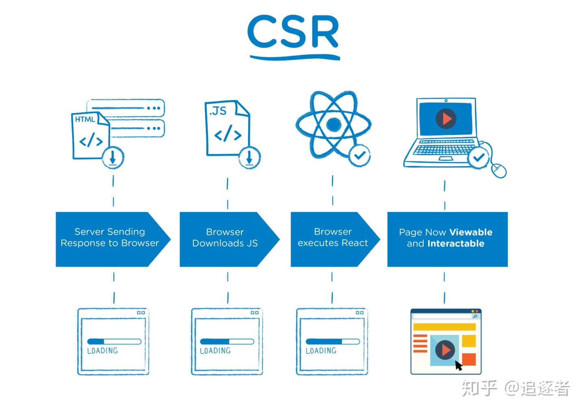
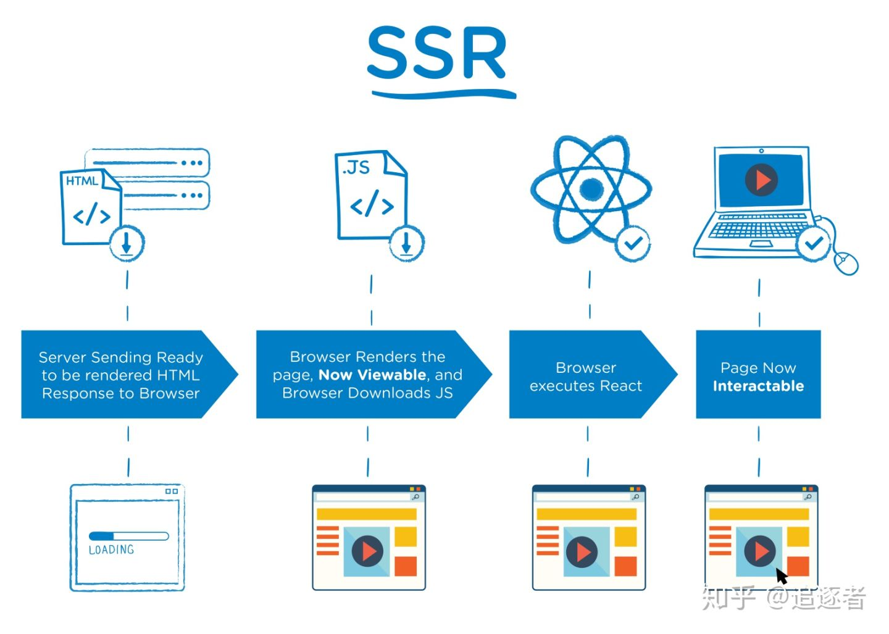
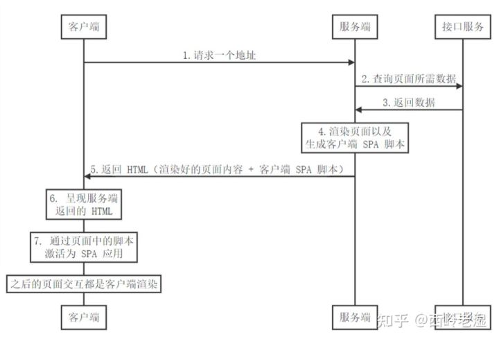

## 基础知识

(文章链接)[https://zhuanlan.zhihu.com/p/346674458]

### CSR
CSR是Client Side Render简称；页面上的内容是我们加载的js文件渲染出来的，js文件运行在浏览器上面，服务端只返回一个html模板。

</img>

### SSR

SSR是Server Side Render简称；页面上的内容是通过服务端渲染生成的，浏览器直接显示服务端返回的html就可以了。

</img>

### SPA的问题

SPA 应用的客户端渲染方式，最大的问题有两个方面：

1. 白屏时间过长，用户体验不好；
2. HTML 中无内容，SEO 不友好；

### 解决方法



没错，这就是我们所说的服务端渲染的基本逻辑，服务端渲染也就是 SSR （Server Side Rendering）；

白屏时间过长的问题得以解决，因为首次加载时，服务器会先将渲染好的静态页面返回，在静态页面中再次加载请求 SPA 脚本；

基本原理：首页内容及数据，在用户请求之前生成为静态页面，同时加入 SPA 的脚本代码引入，在浏览器渲染完成静态页面后，请求 SPA 脚本应用，之后的页面交互依然是客户端渲染；


:::tip
路由集成后虽然能够根据路径渲染指定的页面组件,但是服务器渲染也存在局限性.

比如你在页面组件模板上加一个v-click事件,结果会发现页面在浏览器上渲染完毕后事件无法响应,这样肯定会违背我们的初衷.

怎么解决这样的棘手的问题呢?我们还是要回到服务器端渲染的本质上来,它做的主要的事情就是返回一个填充满页面内容html给客户端,至于后面怎么样它就不管了.

事件绑定,点击链接跳转这些都是浏览器赋予的能力.因此可以借助客户端渲染来帮助我们走出困境.

整个流程可以设计如下.

- 浏览器输入链接请求服务器,服务器端将包含页面内容的html返回,但是在html文件下要加上客户端渲染的js脚本.
- html开始在浏览器上加载,页面上已经呈现出静态内容了.当线程走到html文件下的script标签,开始请求客户端渲染的脚本并执行.
- 此时客户端脚本里面的vue实例开始接管了整个应用,它开始赋予原本后端返回的静态html各种能力,比如让标签上的事件绑定开始生效.

这样就将客户端渲染和ssr联合了起来.ssr只负责返回静态的html文件内容,目的是为了让页面快点展现出来.而客户端的vue实例在静态页面渲染后开始接管整个应用,赋予页面各种各样的能力,这种协作的方式就称为`同构`.
:::

## 路由

### 动态路由

在 Nuxt.js 里面定义带参数的动态路由，需要创建对应的以下划线作为前缀的 Vue 文件 或 目录。

以下目录结构：

```md
pages/
--| _slug/
-----| comments.vue
-----| index.vue
--| users/
-----| _id.vue
--| index.vue
```

Nuxt.js 生成对应的路由配置表为：
```js
router: {
  routes: [
    {
      name: 'index',
      path: '/',
      component: 'pages/index.vue'
    },
    {
      name: 'users-id',
      path: '/users/:id?',
      component: 'pages/users/_id.vue'
    },
    {
      name: 'slug',
      path: '/:slug',
      component: 'pages/_slug/index.vue'
    },
    {
      name: 'slug-comments',
      path: '/:slug/comments',
      component: 'pages/_slug/comments.vue'
    }
  ]
}
```

你会发现名称为 `users-id` 的路由路径带有 `:id?` 参数，表示该路由是可选的。如果你想将它设置为必选的路由，需要在 `users/_id` 目录内创建一个 `index.vue` 文件。

### 嵌套路由

在父组件(.vue文件) 内增加 `<nuxt-child/>` 用于显示子视图内容。

### 未知嵌套深度的动态嵌套路由

如果您不知道 URL 结构的深度，您可以使用_.vue动态匹配嵌套路径。这将处理与更具体请求不匹配的情况。

文件结构:
```md
pages/
--| people/
-----| _id.vue
-----| index.vue
--| _.vue
--| index.vue
```

将处理这样的请求：

| Path                     | File               |
| ------------------------ | ------------------ |
| `/`                      | `index.vue`        |
| `/people`                | `people/index.vue` |
| `/people/123`            | `people/_id.vue`   |
| `/about`                 | `_.vue`            |
| `/about/careers`         | `_.vue`            |
| `/about/careers/chicago` | `_.vue`            |

Note: 处理 404 页面，现在符合_.vue页面的逻辑。

## 配置

### head

1. Nuxt.config.js 文件中配置
2. 单文件中 `head()` 配置 

## 视图

### 模板

模板
你可以定制化 Nuxt.js 默认的应用模板。

定制化默认的 html 模板，只需要在 src 文件夹下（默认是应用根目录）创建一个 app.html 的文件。

默认模板为：
```html
<!DOCTYPE html>
<html {{ HTML_ATTRS }}>
  <head {{ HEAD_ATTRS }}>
    {{ HEAD }}
  </head>
  <body {{ BODY_ATTRS }}>
    {{ APP }}
  </body>
</html>
```

举个例子，你可以修改模板添加 IE 的条件表达式：
```html
<!DOCTYPE html>
<!--[if IE 9]><html lang="en-US" class="lt-ie9 ie9" {{ HTML_ATTRS }}><![endif]-->
<!--[if (gt IE 9)|!(IE)]><!--><html {{ HTML_ATTRS }}><!--<![endif]-->
  <head {{ HEAD_ATTRS }}>
    {{ HEAD }}
  </head>
  <body {{ BODY_ATTRS }}>
    {{ APP }}
  </body>
</html>
```

## API

### 特殊配置项

Nuxt.js 为页面提供的特殊配置项：

| 属性名      | 描述                                                         |
| ----------- | ------------------------------------------------------------ |
| asyncData   | 最重要的一个键, 支持 [异步数据处理](https://www.nuxtjs.cn/guide/async-data)，另外该方法的第一个参数为当前页面组件的 [上下文对象](https://www.nuxtjs.cn/api#上下文对象)。 |
| fetch       | 与 `asyncData` 方法类似，用于在渲染页面之前获取数据填充应用的状态树（store）。不同的是 `fetch` 方法不会设置组件的数据。详情请参考 [关于 fetch 方法的文档](https://www.nuxtjs.cn/api/pages-fetch)。 |
| head        | 配置当前页面的 Meta 标签, 详情参考 [页面头部配置 API](https://www.nuxtjs.cn/api/pages-head)。 |
| layout      | 指定当前页面使用的布局（`layouts` 根目录下的布局文件）。详情请参考 [关于 布局 的文档](https://www.nuxtjs.cn/api/pages-layout)。 |
| loading     | 如果设置为`false`，则阻止页面自动调用`this.$nuxt.$loading.finish()`和`this.$nuxt.$loading.start()`,您可以手动控制它,请看[例子](https://nuxtjs.org/examples/custom-page-loading),仅适用于在 nuxt.config.js 中设置`loading`的情况下。请参考[API 配置 `loading` 文档](https://www.nuxtjs.cn/api/configuration-loading)。 |
| transition  | 指定页面切换的过渡动效, 详情请参考 [页面过渡动效](https://www.nuxtjs.cn/api/pages-transition)。 |
| scrollToTop | 布尔值，默认: `false`。 用于判定渲染页面前是否需要将当前页面滚动至顶部。这个配置用于 [嵌套路由](https://www.nuxtjs.cn/guide/routing#嵌套路由)的应用场景。 |
| validate    | 校验方法用于校验 [动态路由](https://www.nuxtjs.cn/guide/routing#动态路由)的参数。 |
| middleware  | 指定页面的中间件，中间件会在页面渲染之前被调用， 请参考 [路由中间件](https://www.nuxtjs.cn/guide/routing#中间件)。 |

### asyncData

1. pages 页面组件才可以去使用，components 中不可以使用
2. asyncData 中没有this

### fetch

fetch 方法用于在渲染页面前填充应用的状态树（store）数据， 与 asyncData 方法类似，不同的是它不会设置组件的数据。

### head

Nuxt.js 使用了 vue-meta 更新应用的 头部标签 Head 和 html 属性。

类型： Object 或 Function
使用 head 方法设置当前页面的头部标签。

在 head 方法里可通过 this 关键字来获取组件的数据，你可以利用页面组件的数据来设置个性化的 meta 标签。

```js
<template>
  <h1>{{ title }}</h1>
</template>

<script>
  export default {
    data() {
      return {
        title: 'Hello World!'
      }
    },
    head() {
      return {
        title: this.title,
        meta: [
          {
            hid: 'description',
            name: 'description',
            content: 'My custom description'
          }
        ]
      }
    }
  }
</script>
```

::wanring
为了避免子组件中的 meta 标签不能正确覆盖父组件中相同的标签而产生重复的现象，建议利用 hid 键为 meta 标签配一个唯一的标识编号。请阅读关于 vue-meta 的更多信息。
:::


## 插件

### 同时注入

如果您需要同时在context，Vue实例，甚至Vuex中同时注入，您可以使用inject方法,它是 plugin 导出函数的第二个参数。将内容注入 Vue 实例的方式与在 Vue 应用程序中进行注入类似。系统会自动将$添加到方法名的前面。

plugins/combined-inject.js:
```js
export default ({ app }, inject) => {
  inject('myInjectedFunction', string => console.log('That was easy!', string))
}
```

nuxt.config.js:
```js
export default {
  plugins: ['~/plugins/combined-inject.js']
}
```

现在您就可以在context，或者Vue实例中的this，或者Vuex的actions/mutations方法中的this来调用myInjectedFunction方法。 

ctx-example-component.vue:
```js
export default {
  mounted() {
    this.$myInjectedFunction('works in mounted')
  },
  asyncData(context) {
    context.app.$myInjectedFunction('works with context')
  }
}
```

```js
store/index.js:

export const state = () => ({
  someValue: ''
})

export const mutations = {
  changeSomeValue(state, newValue) {
    this.$myInjectedFunction('accessible in mutations')
    state.someValue = newValue
  }
}

export const actions = {
  setSomeValueToWhatever({ commit }) {
    this.$myInjectedFunction('accessible in actions')
    const newValue = 'whatever'
    commit('changeSomeValue', newValue)
  }
}
```

:::tip
Vue 实例（客户端）, context（服务器端）, store(Vuex)
:::

不支持 ssr 的系统，插件只在浏览器里使用，这种情况下下，你可以用 ssr: false ，使得插件只会在客户端运行。

### 传统命名插件

如果假设插件仅在 客户端 或 服务器端 运行，则 .client.js 或 .server.js可以作为插件文件的扩展名应用，该文件将自动包含在相应客户端或者服务端上。

例子:
```js
nuxt.config.js:

export default {
  plugins: [
    '~/plugins/foo.client.js', // only in client side
    '~/plugins/bar.server.js', // only in server side
    '~/plugins/baz.js' // both client & server
  ]
}
```

## 注意事项

1. 您可以通过检测process.server这个变量来控制插件中的某些脚本库只在服务端使用。当值为 true 表示是当前执行环境为服务器中。此外，可以通过检查process.static是否为true来判断应用是否通过nuxt generator生成。您也可以组合process.server和process.static这两个选项，确定当前状态为服务器端渲染且使用nuxt generate命令运行。

2. 由于Nuxt.js 2.4，模式已被引入作为插件的选项来指定插件类型，可能的值是：client 或 server, ssr:false 在下一个主要版本中弃用,将过渡为 mode: 'client'。

3. 从 Nuxt 2.0 开始，~/alias将无法在CSS 文件中正确解析。你必须在 url CSS 引用中使用~assets（没有斜杠）或@别名，即background:url("~assets/banner.svg")

4. $nuxt 是一个专注于改善用户用户体验的帮手。

`isOffline`
类型: Boolean
描述: true 当用户互联网连接变为离线时

`isOnline`
类型: Boolean
描述: isOffline相反
例子:

layouts/default.vue:
```vue
<template>
  <div>
    <div v-if="$nuxt.isOffline">You are offline</div>
    <nuxt />
  </div>
</template>
```
