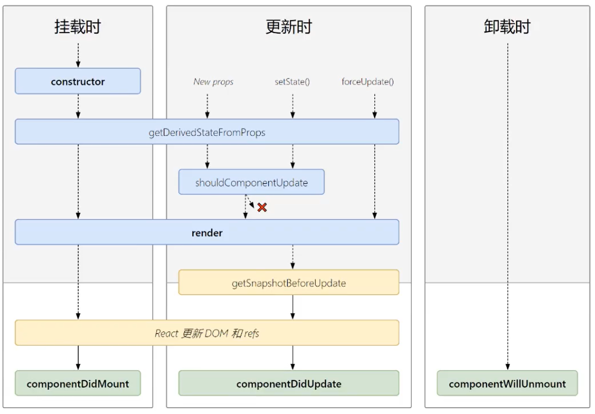
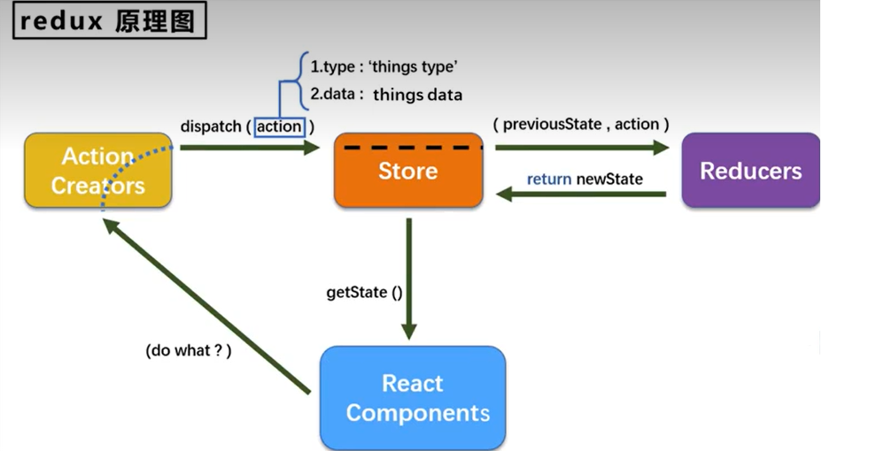
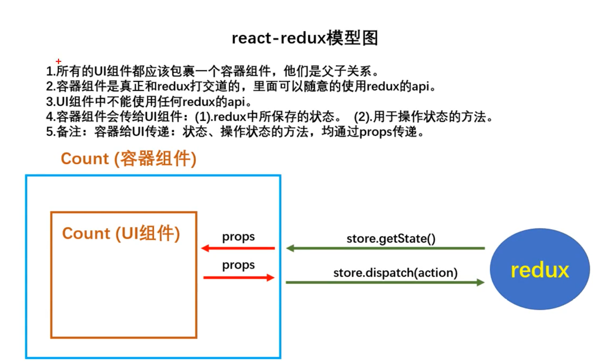

### 创建安装

```bash
npm install -g create-react-app
create-react-app hello
```

### JSX 语法规则

```
1. 定义虚拟 dom 时，不要写引号

2. 标签中混入JS表达式要用{}

3. 样式的类名指定不用class，要用className

4. 内联样式，要用"style = {{key:value}} "的形式写

5. 只有一个根标签 

6. 标签必须闭合

7. 标签首字母
(1).若小写字母开头，则将改标签转为html中同名元素，若html中无该标签对应的同名元素，则报错。
(2).若大写字母开头，react就去渲染对应的组件，若组件没有定义，则报错。
```


> 一定注意区分：【js语句(代码)】与【js表达式】
> 
> 1.表达式：一个表达式会产生一个值，可以放在任何一个需要值的地方下面这些都是表达式：
> 
> (1)a
> 
> (2)a+b
> 
> (3)demo(1)
> 
> (4)arr.map()
> 
> (5)function test(){}
> 
> 2.语句(代码)：
> 
> 下面这些都是语句(代码)：
> 
> (1)if()
> 
> (2)for(){}
> 
> (3)switch(){case:xxxx


### state

值必须是对象

### props

props是只读的

```react
class Preson extends React.Component{
    render(){
        return (
            <ul>
                <li>{this.props.name}</li>
            </ul>)
    }
}

 // 限制props的类型和必填
Person.propTypes = {
    name:PropsTypes.string.isRequired,
    speak:PropsTypes.func
}

// 限制props的默认值
Person.defaultProps = {
    name:"Jack"
}

ReactDOM.render(<Person name="Tom" />,document.getElementById("test"))
```

简写方式

```react
class Preson extends React.Component{
    static propTypes = {
        name:PropsTypes.string.isRequired,
        speak:PropsTypes.func
    }

	static defaultProps = {
        name:"Jack"
    }
    
    render(){
        return (
            <ul>
                <li>{this.props.name}</li>
            </ul>)
    }
}

ReactDOM.render(<Person name="Tom" />,document.getElementById("test"))
```


### ref

1. 字符串类型

   声明：在需要标签的节点上添加  ref = "inputNode"

   调用：this.refs.inputNode

2. 回调函数类型

   声明：在需要标签的节点上添加  ref = { c => this.inputNode = c }

   调用：this.inputNode

3. createRef

   声明：在类中先声明 myRef = React.createRef() ，在需要标签的节点上添加 ref = { this.myRef }

   调用：this.myRef


react事件在原基础上，首字母大写

onClick,onChange


### react 和 vue 事件绑定的区别

react触发change事件,事件的回调需要函数

> onChange = { this.saveFormData("username") }
>
> 跟在onChange后面的需要是一个函数，因此saveFormData函数需要返回一个函数
>
> saveFormData = (type)=>{
>
> ​	return ()=>{
>
> ​		console.log("123")
>
> ​	}
>
> }

或者

> onChange = { (event) => { this.saveFormData("username",event) } }
>
> saveFormData = (type,event)=>{
>
> ​		console.log("123")
>
> }

vue 触发change事件

> @change = saveFormData("username")
>
> vue不需要返回一个函数
>
> saveFormData = (type)=>{
>
> ​		console.log("123")
>
> }


### 生命周期

react生命周期函数(旧)


```react
// 卸载组件
ReactDOM.unMountComponentAtNode(节点)
```

shouldComponentUpdate 返回值为false时不会重新渲染更新，为true时重新渲染，默认为true

```react
shouldComponentUpdate(nextProps，nextState){
	console.log(this.props，this.state)；//目前的props 和state 
    console.1og(nextProps，nextState)；//接下要变化的目标props，目标state 					         if(this.state.carName === nextState.carName) return false 
    else return true
}
```


forceUpdate 不修改状态的情况下更新组件

react生命周期函数(新)


新旧对比：

废弃了3个生命周期函数
> componentWillMount
> 
> componentWillReciveProps
> 
> componentWillUpdate

增加了两个生命周期函数
> getDerivedStateFromProps
> 
> getSnapshotBeforeUpdate

`getSnapshotBeforeUpdate`

在更新前获取快照值，返回值将做为 componentDidUpdate 生命周期函数的第三个参数，componentDidUpdate 的前两个参数为更新之前的props和state

例:`componentDidUpdate( prevProps, preState, snapshotValue )`


### 路由

路由组件的props属性的三个特有api：history,location,match

1. react-router-dom

```react
// 管理路由器，有两种，BrowserRouter和HashRouter,类似于vue的createWebHistory()和createWebHashHistory()
<BrowserRouter>
    // 编写路由链接,类似与vue的router-link
    <Link to="/home">Home</Link>
    // 注册路由，类似与vue的router-view
    <Route path="/home" component={Home}></Route>
</BrowserRouter>
```

```react
// 导航路由 ,切换路由时会自动添加类名
<NavLink activeClassName="active" to="/home">Home</NavLink>
<NavLink activeClassName= "active" to="/about">About</NavLink>
```

2. this.props.children

父子组件中标签体的内容会被收集到 `this.props.children `中

写在标签的`children`的值也会被放入标签体之间

```react
<NavLink activeClassName="active" to="/home">Home</NavLink>
// 等价于
<NavLink activeClassName="active" to="/home" children="Home"/>
```

3. Switch标签

react的路由匹配时，会一直往下匹配，当路径指向多个路由时，会展示多个路由，要想只匹配一次就结束，可以包括switch标签

```react
<Switch>
    <NavLink activeClassName="active" to="/home">Home</NavLink>
</Switch>
```

4. 路由匹配

模糊匹配和精准匹配

模糊匹配：`link`标签的`to`属性只要`route`的`path`的一部分就可以匹配成功，输入的路径必须包含匹配的路径，且顺序要一致

精准匹配：`link`标签的`to`属性只要`route`的完全相同

```react
<Route exact={true} path="/home" component={Home}></Route>
<Route exact path="/home" component={Home}></Route>
```

5. 重定向

```react
<Route path="/home" component={Home}></Route>
// 兜底匹配，没有匹配时听从redirect 
<redirect to="/home"></redirect>
```

6. 嵌套路由

> 注册子路由时要写上父路由的path值
>
> 路由的匹配是按照注册路由的顺序进行的

7. 路由组件传参

```react
// params 传参，子组件可以从this.props.match.params拿到数据
<Link to="/home/001">Home</Link>
<Route path="/home/:id" component={Home}></Route>
// search 传参,子组件可以从this.props.location.search拿到数据，querystring整理数据,将urlencoded转为对象
<Link to="/home?id=001">Home</Link>
<Route path="/home" component={Home}></Route>
// state传参，参数不会展示在地址栏，子组件可以从this.props.location.state拿到数据，
<Link to={{pathname:"/home",state:{id:001}}}>Home</Link>
<Route path="/home" component={Home}></Route>
```

8. replace模式(替换栈顶的history)

```react
<Link replace={true} to="/home">Home</Link>
```

9. 编程式路由导航

```react
this.props.history.push("/home")
this.props.history.replace("/home")
// 如果传第二个参数，将最为state的值
push(path,state)

this.props.history.go(n)
this.props.history.goBack()
this.props.history.goForward()
```

10. 普通组件获取路由组件的特有api

```react
withRouter(普通组件)
```


### react自定义配置

引入`react-app-rewired`并修改`package.json`里的启动配置。由于新的` react-app-rewired@2.x`版本的关系，你还需要安装`ustomize-cra`。

```bash
# react-app-rewired用于启动项目，custome-cra用于修改配置
yarn add react-app-rewired custome-cra
```



```json
/*package.json*/
"scripts":{
        -"start":"react-scripts start",
        +"start":"react-app-rewired start",
        -"build":"react-scripts build",
        +"build":"react-app-rewired build",
        -"test":"react-scripts test",
        +"test":"react-app-rewired test"
}
```

然后在项目根目录创建一个`config-overrides.js`用于修改默认配置。

```js
module. exports=function override(config, env){
    //do stuff with the webpack config..…
    return config;
};
```


### redux

 

> 创建一个store对象：调用`createStore(reducer)`创建一个`store`对象
>
> `reducer`可以有多个，负责初始化和修改`state`的值，本质上是一个函数，接受两个参数，第一个参数为`previousState`,第二个参数为`action`对象，返回值将做为新的`state`值。初始化调用时`previousState`的值为`undefined`，action对象中type为`@@redux/INIT`，`data`值为空
>
> `action`有两种情况，一个是对象包括两个参数，第一个为`type`，第二个为`data`,表示同步action，第二种是函数，   表示异步action
>
> > (1)明确：延迟的动作不想交给组件自身，想交给action
> > (2)何时需要异步action：想要对状态进行操作，但是具体的数据靠异步任务返回。
> > (3)具体编码：
> >
> > >yarn add redux-thunk，并配置在store中
> > >
> > >创建action的函数不再返回一般对象，而是一个函数，该函数中写异步任务。
> > >
> > >异步任务有结果后，分发一个同步的action去真正操作数据。
> > >
> > >备注：异步action不是必须要写的，完全可以自己等待异步任务的结果了再去分发同步action。
>
> 当有多个reducer时，调用combineReducers
>
> ```react
> import {createStore,apopluMiddleWare,combineReducers} from'redux'
> // 引入redux-thunk,用于异步支持action
> import thunk from "redux-thunk"
> //引入为Count组件服务的reducer
> import countReducer from'./count_reducer'
> //引入为Person组件服务的reducer
> import personReducer from'./person_reducer'
> // 汇总所有的reducer
> const allReducer = combineReducers({
>  count:countReducer,
>  person:personReducer
> }) 
> //暴露store
> export default createStore(allReducer,applyMiddleware(thunk))
> ```
> 
>
>  在reducer中修改state的值时 ，对于对象和数组，需要返回新的数组和对象，redux是浅比较
>
> redux开发者工具
>
> 1. yarn add redux-devtools-extension
>
> 2. store中进行配置
>
>    ```react
>    import {composewithDeVTools} from'redux-devtools-extension'
>    const store = createStore(allReducer，composewithDevTools(applyMiddleware(thunk)))
>    ```
>
>    

```react
// store.js
import {createStore,apopluMiddleWare} from'redux'
// 引入redux-thunk,用于异步支持action
import thunk from "redux-thunk"
//引入为Count组件服务的reducer
import countReducer from'./count_reducer'
//暴露store
export default createStore(countReducer,applyMiddleware(thunk))

//count_action.js
/*
	该文件专门为count组件生成action对象
*/
import{INCREMENT，DECREMENT}from'./constant'
//同步action，就是指action的值为object类型的一般对象
export const createIncrementAction = data=>({type:INCREMENT,data})
export const createDecrementAction = data=>({type:DECREMENT,data})
//异步action，就是指action的值为函数,异步action中一般都会调用同步action
export const createIncrementAsyncAction=(data，time)=>{
    return (dispatch)=>{
        setTimeout(()=>{
            dispatch(createIncrementAction(data))
        },time)
}

// count_redux.js
const initstate = 0//初始化状态
export default function countReducer(preState=initstate，action){
    // console.1og(preState)；
    // 从action对象中获取：type、data
    const{type，data}=action
    // 根据type决定如何加工数据
    switch(type){
        case'increment'：
        	//如果是加
        	return preState + data
        case'decrement'：
        	//若果是减
        	return preState - data 
        default：
        	// state的初始值
        	return preState
    }
}
    
//count.js
store.dispatch(createIncrementAsyncAction(value,500))
        
// app.jsx
// 监测redux中状态的改变，如redux的状态发生了改变，那么重新渲染App组件
store.subscribe(()=>{
	ReactDoM.render(<App/>,document.getE1ementById('root')
)
```


1. `store.getState()`

获取state的值

2. `store.subscribe(()=>{})`

当state的任何值改变时，会调用回调函数

3. `store.dispatch(action对象)`

修改state的值


### react-redux



> (1).明确两个概念：
>
> >1 UI组件：不能使用任何redux的api，只负责页面的呈现、交互等。
> >2 容器组件：负责和redux通信，将结果交给UI组件。
>
> (2).如何创建一个容器组件——靠react-redux的connect函数`connect(mapStateToProps,mapDispatchToProps)(UI组件)`
>
> > -mapStateToProps：映射状态，返回值是一个对象
> > -mapDispatchToProps：映射操作状态的方法，返回值是一个对象
>
> (3).备注：容器组件中的store是靠props传进去的，而不是在容器组件中直接引入
>
> (4).容器组件和UI组件混成一个文件
>
> (5).无需自己给容器组件传递store，给`<App/>`包裹一个`<Provider store={store}>`即可。
>
> (6).使用了`react-redux`后也不用再自己检测`redux`中状态的改变了，容器组件可以自动完成这个工作。
>
> (7).mapDispatchToProps也可以简单的写成一个对象
>
> (8).一个组件要和redux“打交道”要经过那几步？
>
> > (1).定义好UI组件---不暴露
> > (2).引入connect生成一个容器组件，并暴露，写法如下：
> >
> > ```react
> > connect(
> >     state =>({key:value})
> >     {key:xxxxxAction}
> > )(UI组件)
> > ```
> >
> > (4).在UI组件中通过`this.props.xxxxxxx`读取和操作状态

```react
- src
	- container
		- Count
			-index.jsx

//引入Count的UI组件
import CountUI from '../../components/Count'
import {createIncrementAction} from'../../redux/count_action'
//引入connect用于连接UI组件与redux 
import {connect} from'react-redux'
/*
    1.mapStateToProps函数返回的是一个对象；
    2.返回的对象中的key就作为传递给UI组件props的key，value就作为传递给UI组件props的value
    3.mapStateToProps用于传递状态
*/
function mapStateToProps(state){
	return {count:state}
}
/*
    1.mapDispatchToProps函数返回的是一个对象；
    2.返回的对象中的key就作为传递给UI组件props的key，value就作为传递给UI组件props的value
    3.mapDispatchToProps用于传递操作状态的方法
*/
function mapDispatchToprops(dispatch){
    return{
    	jia:number => dispatch(createIncrementAction(number))
    }
    // 简写形式
    /*return{
    	jia:createIncrementAction
    }*/
}

// 使用connect()()创建并暴露一个count的容器组件
export default connect(mapStateToProps,mapDispatchToProps)(CountUI)
```


### setState 

setstate更新状态的2种写法 

```
(1).setstate(statechange，[callback])----—-对象式的setstate
    1.statechange为状态改变对象(该对象可以体现出状态的更改)
    2.callback是可选的回调函数，它在状态更新完毕、界面也更新后(render调用后)才被调用(2).setstate(updater，[ca1lback])------函数式的setstate
    1.updater为返回statechange对象的函数。
    2.updater可以接收到state和props。
    3.callback是可选的回调函数，它在状态更新、界面也更新后(render调用后)才被调用。
    
总结：
1.对象式的setstate是函数式的setState的简写方式(语法糖)
2.使用原则：
(1).如果新状态不依赖于原状态===>使用对象方式
(2).如果新状态依赖于原状态===>使用函数方式
(3).如果需要在setState()执行后获取最新的状态数据，要在第二个callback函数中读取
```

### lazyLoad

路由组件的lazyLoad,懒加载

```jsx
//1.通过React的1azy函数配合import()函数动态加载路由组件===>路由组件代码会被分开打包
const Login = lazy(()=>import('@/pages/Login'))
//2.通过<Suspense>指定在加载得到路由打包文件前显示一个自定义1oading界面
<Suspense fallback={<h1>loading.....</h1>}>
    <Switch>
        <Route path="/xxx" component={xxxx}/>
        <Redirect to="/1ogin"/>
    </Switch> 
</Suspense>
```


### Hooks

```
1.React Hook/Hooks是什么？
(1).Hook是React 16.8.0版本增加的新特性/新语法
(2).可以让你在函数组件中使用state以及其他的React 特性

2.三个常用的Hook
(1).state Hook:React.usestate()
(2).Effect Hook:React.useEffect()
(3).Ref Hook:React.useRef()

3.State Hook
(1).State Hook让函数组件也可以有state状态，并进行状态数据的读写操作
(2).语法：const[xxx，setxxx]=React.usestate(initValue)
(3).usestate()说明：
    参数：第一次初始化指定的值在内部作缓存
    返回值：包含2个元素的数组，第1个为内部当前状态值，第2个为更新状态值的函数
(4).setxxx()2种写法：
    setxxx(newvalue)：参数为非函数值，直接指定新的状态值，内部用其覆盖原来的状态值
    setxxx(value =>newValue)：参数为函数，接收原本的状态值，返回新的状态值，内部用其覆盖原来的状态值

4.Effect Hook
(1).Effect Hook 可以让你在函数组件中执行副作用操作(用于模拟类组件中的生命周期钩子)
(2).React中的副作用操作：
        发ajax请求数据获取
        设置订阅/启动定时器
        手动更改真实DOM
(3).语法和说明：
        useEffect(()=>{
            //在此可以执行任何带副作用操作
            return()=>{ //在组件卸载前执行
            //在此做一些收尾工作，比如清除定时器/取消订阅等
            }
        }，[statevalue])//监测特定的值，改变时会重新执行此函数，不写默认监控所有 ，如果指定的是[]，回调函数只会在第一次render()后执行
(4).可以把useEffect Hook 看做如下三个函数的组合
        componentDidMount()
        componentDidupdate()
        componentwi11unmount()
        
5.Ref Hook
(1).Ref Hook可以在函数组件中存储/查找组件内的标签或任意其它数据
(2).语法：const refcontainer = useRef()
(3).作用：保存标签对象，功能与React.createRef()一样
```


### Fragment

使用

```react
<Fragment></Fragment>
<></>
```

作用
可以不用必须有一个真实的DOM根标签了


### context

祖孙组件通信

使用

```js
1)创建Context容器对象：
	const Xxxcontext = React.createContext()
2)渲染子组时，外面包裹xxxContext.Provider，通过value属性给后代组件传递数据：
	<Xxxcontext.Provider value={数据}>
		子组件
	</Xxxcontext.Provider>
3)后代组件读取数据：
	//第一种方式：仅适用于类组件
	static contextType=xxxcontext//声明接收context 
	this.context//读取context中的value数据

    //第二种方式：函数组件与类组件都可以
    <Xxxcontext.Consumer>
        {
        	 value=>(//value就是context中的value数据要显示的内容
        	)
    	}
    </Xxxcontext.Consumer>
```

注意
在应用开发中一般不用context，一般都用它的封装react插件


### 组件优化

Component 的2个问题
1.只要执行setState()，即使不改变状态数据，组件也会重新render()=>效率低

2.只当前组件重新render()，就会自动重新render子组件，纵便子组件没有用到父组件的任何数据==>效率低

效率高的做法
只有当组件的state或props数据发生改变时才重新render

原因
Component中的shouldComponentUpdate)总是返回true

解决

```
办法1：
重写shouldcomponentUpdate()方法
比较新旧state或props数据，如果有变化才返回true，如果没有返回false

办法2：
使用Purecomponent 
PureComponent重写了shouldcomponentUpdate()，只有state或props数据有变化才返回true
注意：
	只是进行state和props数据的浅比较，如果只是数据对象内部数据变了，返回false
	不要直接修改state数据，而是要产生新数据
	
项目中一般使用Purecomponent来优化
```


### render props 

如何向组件内部动态传入带内容的结构(标签)？

```
vue中：
	使用slot技术，也就是通过组件标签体传入结构<A><B/></A>
React中：
	使用children props：通过组件标签体传入结构
	使用render props：通过组件标签属性传入结构，一般用render函数属性
```

children props

```
<A>
	<B>xxxx</B>
</A>
{this.props.children}
问题：如果B组件需要A组件内的数据，==>做不到
```

render props

```
<A render={(data) => <c data={data}></c>}></A>
A组件：{this.props.render(内部state数据)}
c组件：读取A组件传入的数据显示{this.props.data}
```

 

### 错误边界

理解：
错误边界(Error boundary)：用来捕获后代组件错误，渲染出备用页面I

特点：
只能捕获后代组件生命周期产生的错误，不能捕获自己组件产生的错误和其他组件在合成事件、定时器中产生的错误

使用方式：

getDerivedStateFromError配合componentDidCatch

```
//生命周期函数，一旦后台组件报错，就会触发
static getDerivedStateFromError(error){
    console.1og(error)；
    //在render之前触发
    //返回新的state 
    return{
    	hasError:true，
	}；
}

componentDidcatch(error，info){
    //统计页面的错误。发送请求发送到后台去
    console.1og(error，info)；
}
```

### 组件通信方式总结

组件间的关系：

- 父子组件

- 兄弟组件(非嵌套组件)

- 祖孙组件(跨级组件)

几种通信方式：

```
1.props：
(1).children props
(2).render props
2.消息订阅-发布：
pubs-sub、event等等
3.集中式管理：
redux、dva等等
4.conText：生产者]-消费者模式
```

比较好的搭配方式：

父子组件：props

兄弟组件：消息订阅-发布、集中式管理

祖孙组件(跨级组件)：消息订阅-发布、集中式管理、conText(开发用的少，封装插件用的多)


## React R outer 6

### component

#### 1. `<BrowserRouter>`

1. 说明：`<BrowserRouter>`用于包裹整个应用。
2. 示例代码：
```
import React from"react"；
import ReactDoM from"react-dom"；
import{BrowserRouter}from"react-router-dom"；
ReactDoM.render(
    <BrowserRouter>
    	{/*整体结构(通常为App组件)*/}
    </BrowserRouter>，root
)；
```


#### 2.`<HashRouter>`

1.说明：作用与`<BrowserRouter>`一样，但`<HashRouter>`修改的是地址栏的hash值。
2.备注：6.x版本中`<HashRouter>`、`<BrowserRouter>`的用法与5.x相同。


#### 3.`<Routes/>`与`<Route/>`

1.v6版本中移出了先前的`<switch>`，引入了新的替代者：`<Routes>`。
2.`<Routes>`和`<Route>`要配合使用，且必须要用`<Routes>`包裹`<Route>`。
3.`<Route>`相当于一个if语句，如果其路径与当前URL匹配，则呈现其对应的组件。
4.`<Route caseSensitive>`属性用于指定：匹配时是否区分大小写(默认为false)。
5.当URL发生变化时，`<Routes>`都会查看其所有子`<Route>`元素以找到最佳匹配并呈现组件。
6.`<Route>`也可以嵌套使用，且可配合`useRoutes()`配置“路由表”，但需要通过`<outlet>`组件来渲染其子路由。
7.示例代码：

```jsx
I<Routes>
    /*path属性用于定义路径，element属性用于定义当前路径所对应的组件*/
    <Route path="/login" element={<Login/>}></Route>
    
    /*用于定义嵌套路由，home是一级路由，对应的路径/home*/
    <Route path="home" element={<Home/>}>
        /*test1和test2是二级路由，对应的路径是/home/test1或/home/test2*/
        <Route path="test1" element={<Test/>}></Route>
        <Route path="test2" element={<Test2/>}></Route>
    </Route>
    
    //Route也可以不写element属性，这时就是用于展示嵌套的路由.所对应的路径是/users/xxx
    <Route path="users">
    	<Route path="xxx" element={<Demo/>}/>
    </Route>
</Routes>
```

#### 4.`<Link>`

1.作用：修改URL，且不发送网络请求(路由链接)。
2.注意：外侧需要用`<BrowserRouter>`或`<HashRouter>`包裹。
3.示例代码：

```jsx
import{Link}from"react-router-dom"；
function Test(){
return(
    <div>
    	<Link to="/路径”>按钮</Link>
    </div>
)；
```

#### 5.`<NavLink>`

1.作用：与`<Link>`组件类似，且可实现导航的“高亮”效果。
2.示例代码：

```jsx
//注意：NavLink默认类名是active，下面是指定自定义的class
//自定义样式
<NavLink 
    to="login" 
    className={({isActive})=>{
        console.log('home'，isActive)
        return isActive？'base one'：'base'
    }}
> 1ogin</NavLink>

/*  默认情况下，当Home的子组件匹配成功，Home的导航也会高亮，当NavLink上添加了end属性后，若Home的子组件匹配成功，则Home的导航没有高亮效果。*/
<NavLink to="home"end >home</NavLink>			
```

#### 6. `<Navigate>`

1. 作用：只要`<Navigate>`组件被渲染，就会修改路径，切换视图

2. replace 属性用于控制跳转模式(push 或replace，默认是push)

3. 示例代码：

   ```jsx
   import React，{useState} from'react'
   import {Navigate} from 'react-router-dom'
   export default function Home(){
   const[sum，setsum]=useState(1)
   return(
       <div>
           <h3>我是Home的内容</h3>
           {/*根据sum的值决定是否切换视图*/}
           {sum === 1 ？<h4>sum的值为{sum}</h4> ：<Navigate to="/about" replace={true}/>}
           <button onClick={()=>setsum(2)}>点我将sum变为2</button>
       </div>
   )
   ```

   

7.`<outlet>`
1.当`<Route>`产生嵌套时，渲染其对应的后续子路由。
2.示例代码：

```jsx
// 根据路由表生成对应的路由规则
const element = useRoutes([
    {
        path:'/about'，
        element：<About/>
    },
    {
        path:/home'，
        element：<Home/>，
        children:[
            {
        		path:'news'，
            	 element：<News/>
    		},
             {
                 path:'message'，
             	element：<Message/>
             }
	    ]
    }   
])

//Home.js import React from'react'
import{Navlink，Outlet}from'react-router-dom'
export default function Home(){
    return(
        <div>
            <h2>Home组件内容</h2>
            <div>
            <ul className="nav nav-tabs">
                <1i>
                    <NaVLink className="list-group-item"to="news">News</NavLink>
                </1i>
                <1i>
                    <NaVLink className="list-group-item"to="message">Message</NavLink>
                </1i>
            </u1>
            {/*指定路由组件呈现的位置*/}
            <outlet/>
            </div>
          </div>
    )
}
```


### Hooks

#### 1.`useRoutes()`

1.作用：根据路由表，动态创建`<Routes>`和`<Route>`


#### 2.`useNavigate()`

1.作用：返回一个函数用来实现编程式导航。
2.示例代码：

```jsx
import React from 'react'
import {useNavigate} from'react-router-dom'
export default function Demo(){
    const navigate = useNavigate()
    const handle =()=>{
    //第一种使用方式：指定具体的路径
    navigate("/login'，{
    	replace:false，
        state:{a：1，b：2}
    })
    
    //第二种使用方式：传入数值进行前进或后退，类似于5.x中的history.go()方法navigate(-1)
    return(
        <div>
       		<button onClick={handle}>按钮</button>
        </div>
    )	
}
```


#### 3.`useParams()`

1.作用：回当前匹配路由的params 参数，类似于5.x中的match.params。


#### 4.`useSearchParams()`

1.作用：用于读取和修改当前位置的URL中的查询字符串。
2.返回一个包含两个值的数组，内容分别为：当前的seaech参数、更新search的函数。
3.示例代码：

```jsx
import React from 'react'
import {useSearchParams} from 'react-router-dom'
export default function Detail(){
    const[search，setSearch]=useSearchParams()
    const id=search.get('id')
    const title=search.get('title')
    const content=search.get('content')
    return(
        <u1>
        <button onclick={()=>setsearch('id=ees&title=哈哈&content=嘻嘻)}>点我更新一下收到的search参数
        </button>
        <1i>消息编号：{id}</1i>
        <1i>消息标题：{title}</1i>
        <1i>消息内容：{content}</1i>
        </ul>
    )
}	                
```


#### 5.`useLocation()`

1.作用：获取当前location信息，对标5.x中的路由组件的ocation]属性。


#### 6.`useMatch()`

1.作用：返回当前匹配信息，对标5.x中的路由组件的match属性。


#### 7.`uselnRouterContext()`

作用：如果组件在`<Router>`的上下文中呈现，则`useInRoutercontext `钩子返回true，否则返回 false。


#### 8.`useNavigationType()`

1.作用：返回当前的导航类型(用户是如何来到当前页面的)。
2.返回值：`POP`、`PUSH`、`REPLACE`。
3.备注：`POP`是指在浏览器中直接打开了这个路由组件(刷新页面)。

#### 9.`useOutlet()`

1.作用：用来呈现当前组件中渲染的嵌套路由。
2.示例代码：

```jsx
const result=useoutlet()
console.1og(result)
//如果嵌套路由没有挂载，则result为nu11
//如果嵌套路由已经挂载，则展示嵌套的路由对象
```


#### 10.`useResolvedPath()`

1.作用：给定一个URL值，解析其中的：path、search、hash值。