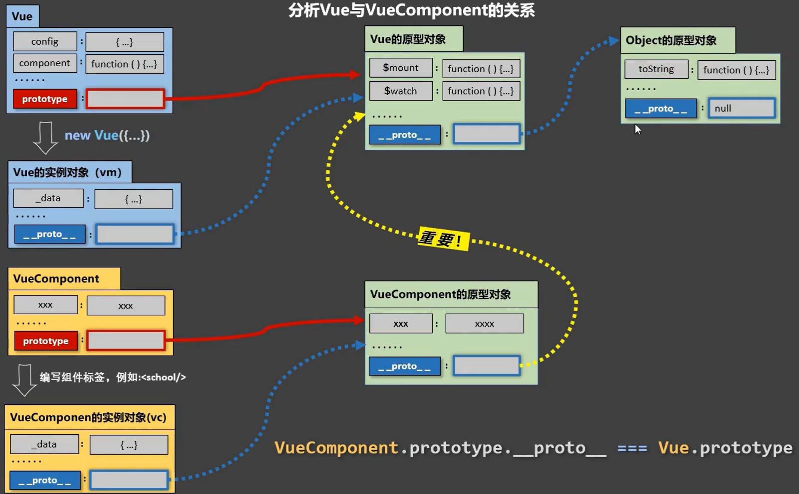

## Vue 动态创建节点
vue.extend()是一个构造器,用来创建一个子类,参数是一个包含组件选项的对象

**从外部引入节点组件**

1.将需要动态添加的节点以及它所绑定的事件以组件的形式,先事先写好
新建一个组件文件NewComponent.vue
```vue
<template>
    <div>
  		<!-- 将要动态添加的节点 -->
        <button @click="fn">点我显示信息</button>
    </div>
</template>
<script>
export default {
    data() {
        return {
            msg:'hello world'
        }
    },
    methods: {
        fn:function(){
            console.log(this.msg);
        }
    },
}
</script>
<style lang="">
    
</style>
```
2.在你想要动态添加一个节点的那个组件中引入NewComponent.vue
```vue
<template>
    <div id='app2'>
      <div id="mount-point"><h1>从外部引入新的节点</h1></div>
      <button @click = "addNode">添加节点</button>
    </div>
</template>
<script>
//引入将要动态添加节点所在的组件
import Append from './NewComponent.vue';
import Vue from 'vue';
export default {
    data(){
        return{
            
        }
    },
    methods:{
        addNode(){
        	//创建一个构造器
         	var Profile = Vue.extend(Append);
            // 创建 Profile 实例，并挂载到一个元素上。
          	new Profile().$mount('#mount-point');
        }
    },
    
}
</script>

<style lang="">

</style>
```

**在内部创建节点组件**

```vue
<template>
    <div id='app2'>
      <div id="mount-point"><h1>在本组件中动态创建新的节点</h1></div>
      <button @click = "addNode">添加节点</button>
    </div>
</template>
<script>
import Vue from 'vue';
export default {
    data(){
        return{
            
        }
    },
    methods:{
        addNode(){
            // 创建构造器
            var Profile = Vue.extend({
                template: '<button @click="fn">内部创建的节点组件</button>',
                data: function () {
                    return {
                        msg:'hello world'
                    }
                },
                methods:{
                    fn(){
                        console.log(this.msg)
                    }
                }
            })
            // 创建 Profile 实例，并挂载到一个元素上。
            new Profile().$mount('#mount-point')
        }
    },
    
}
</script>

<style lang="">

</style>
```

**间接挂载**

上面两种方式动态创建已经绑定事件的节点组件,在浏览器中运行,当点击"添加节点"按钮,便将节点所在的组件,挂载到id="mount-point"的div中,注意这里的挂载是会把id="mount-point"的div给完全的替换掉,然后你再点击新创建的节点上绑定的事件,是可以触发的
新动态添加的节点会覆盖被挂载的节点,那么如果我想要保留被挂载的节点怎么办呢?
我们可以采用不直接挂载,采用间接挂载的方式,在原先想要挂载的那个挂载点的内部,使用原生js动态创建一个新节点,将节点组件挂载到这个节点上
```vue
<template>
    <div id='app2'>
      <div id="mount-point"><h1>在本组件中动态创建新的节点</h1></div>
      <button @click = "addNode">添加节点</button>
    </div>
</template>
<script>
import Vue from 'vue';
export default {
    data(){
        return{
            
        }
    },
    methods:{
        addNode(){
            //手动创建节点,实现间接挂载
                var mpNode=document.createElement('div');
                mpNode.setAttribute('id','mp');
                var pnode=document.querySelector("#mount-point");
                pnode.appendChild(mpNode);
                
            // 创建构造器
            var Profile = Vue.extend({
                template: '<button @click="fn">内部创建的节点组件</button>',
                data: function () {
                    return {
                        msg:'hello world'
                    }
                },
                methods:{
                    fn(){
                        console.log(this.msg)
                    }
                    
                }
            })
            // 创建 Profile 实例，并挂载到一个元素上。
            new Profile().$mount('#mp')
        }
       
    },
    
}
</script>

<style lang="">

</style>
```

**组件传值**

使用组件构造器创建组件是解决了原生js创建DOM节点，绑定的事件失效的问题，那现在问题又来了，新创建的组件和原来组件之间怎么传值呢？
外部组件传到新创建组件

新创建的组件用props将外部传进来的参数存起来
新创建的组件在挂载时以对象的方式传入参数,传入的值存在propsData中
```vue
<template>
    <div id='app2'>
      <div id="mount-point"><h1>在本组件中动态创建新的节点</h1></div>
      <button @click = "addNode">添加节点</button>
    </div>
</template>
<script>
import Vue from 'vue';
export default {
    data(){
        return{
            
        }
    },
    methods:{
        addNode(){
            //手动创建节点,实现间接挂载
                var mpNode=document.createElement('div');
                mpNode.setAttribute('id','mp');
                var pnode=document.querySelector("#mount-point");
                pnode.appendChild(mpNode);
                
            // 创建构造器
            var Profile = Vue.extend({
                template: '<button @click="fn">内部创建的节点组件</button>',
                data: function () {
                    return {
                        msg:'hello world'
                    }
                },
                props:['str'],
                methods:{
                    fn(){
                        console.log(this.str)
                    }
                }
            })
            // 创建 Profile 实例，并挂载到一个元素上。
            new Profile({
            	propsData:{str:'你好呀'}
            }).$mount('#mp')
        }
       
    },
    
}
</script>

<style lang="">

</style>
```

**利用数组以及v-for实现动态创建节点**

```vue
<template>
    <div id='app2'>
      <div v-for="(v,i) in data" v-bind:key="i">
          <input type="text" placeholder="type it" v-model="data[i]"><button @click="del()">取消</button>
      </div>
      <button @click = "createNode">创建表单input节点</button>
      <button @click = "getdata">获取所有input值</button>
    </div>
</template>
<script>
import Vue from 'vue';
export default {
    data(){
        return{
            data:[],
            index:0
           
        }
    },
    methods:{
        getdata(){
console.log(this.data);
        },
        del(){
           event.currentTarget.parentNode.style.display='none';
        },
        createNode(){
            this.index++;
            console.log(this.index);
            var str="请输入选项"
            var ele=str+this.index;
            this.data.push(ele);
        }
       
    },
    
}
</script>

<style lang="">

</style>
```
[文章来源](https://juejin.cn/post/6844904005437489160)

## vue 与 vuecomponent 的关系


## vue 中动态引入图片
```js
// 官方推荐方法
function getImageUrl(name) {
    return new URL(`../assets/blogPhotos/${name}.jpg`, import.meta.url).href;
}

// 打包后可能图片无法显示，可选择下面方法
import imageUrl from "../assets/images/test.png"
document.getElementById("test").src = imageUrl
```

## css 中调用 js 变量

在css中：

在css中主要通过直接进行绑定，主要包括几种使用方式（我自己编的名词）：直接使用、拼接使用、对象调用、组合使用【这是我想到的几种常见方式，如果有特殊需求，可以评论区沟通】

在JS中先对需要用的数据进行定义：

```js
// 进行拼接调用测试的数据
let width = 400

// 直接调用的数据
let div_height = '400px'
let div_color = '#e89393'

// 对象调用的数据
let span = {
  width: '200px',
  height: '200px',
  color: 'green',
}

// 组合调用的数据
let transition = 'cubic-bezier(0, 1.5, .6, 1)'
```

然后这些数据直接在css中进行使用，使用v-bind()进行绑定

```css
<style scoped lang="css">
.div {
  /* 拼接使用 */
  width: v-bind(width + 'px');
  /* 直接使用 */
  height: v-bind(div_height);
  background: v-bind(div_color);
}

.span {
  /* 对象调用 */
  width: v-bind('span.width');
  height: v-bind('span.height');
  background: v-bind('span.color');
  display: flex;
  justify-content: center;
  align-items: center;
}

.span_title {
  width: 100px;
  height: 100px;
  background: #000;
  color: white;
  /* 组合使用 */
  transition: all .9s v-bind(transition);
}

.span:hover .span_title {
  border-radius: 50%;
  background: #a5f5b8;
  color: #ff0000;
}
</style>
```

在对应的四个方式的调用中：

直接使用：完全没有问题

拼接使用：这个在css中没有问题，不过在scss中会出现错误，这个在下面的scss中会有详细介绍

对象调用：对象的调用和直接使用类似，不过不同的是，需要使用引号的包裹才能正常使用，如果直接书写会报错

组合使用：完全没问题

[文章来源](https://blog.csdn.net/weixin_52235488/article/details/126290046)