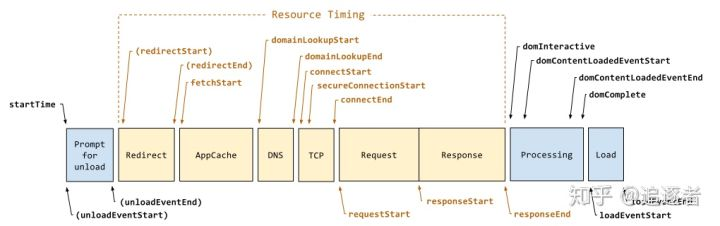

# 学习
## 相对路径特殊符号
在表示相对路径中，单点表示当前目录，双点表示上一级目录，反斜杠“/”表示分隔目录； 
相对路径特殊符号有以下几种表示意义： 
- 以“./”开头，代表当前目录和文件目录在同一个目录里，“./”也可以省略不写！ 
- 以"../"开头：向上走一级，代表目标文件在当前文件所在的上一级目录； 
- 以"../../"开头：向上走两级，代表父级的父级目录，也就是上上级目录，再说明白点，就是上一级目录的上一级目录 
- 以"/”开头，代表根目录 

## 输入页面URL到页面渲染完成大致流程

- 解析URL
- 浏览器本地缓存
- DNS解析
- 建立TCP/IP连接
- 发送HTTP请求
- 服务器处理请求并返回HTTP报文
- 浏览器根据深度遍历的方式把html节点遍历构建DOM树
- 遇到CSS外链，异步加载解析CSS，构建CSS规则树
- 遇到script标签，如果是普通JS标签则同步加载并执行，阻塞页面渲染，如果标签上有defer / async属性则异步- 加载JS资源
- 将dom树和CSS DOM树构造成render树
- 渲染render树

